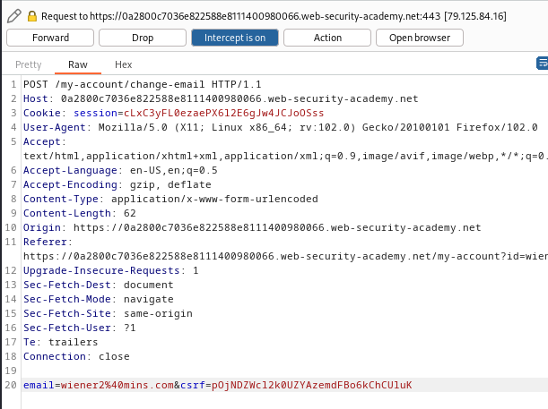

### CSRF where token is not tied to user session : PRACTITIONER

---


> Given credentials `wiener:peter`.
> Given credentials `carlos:montoya`.

> Logging in with the given credentials.


> We see this page.


> We know that the update email is vulnerable to CSRF.


> Setting a new email and intercepting the request via BURPSUITE PROXY intercept.



> We take note of the `csrf` token.
```
csrf=pOjNDZWcl2k0UZYAzemdFBo6kChCUluK
```

> After that, we **drop** the request, since these tokens are single use.
> Now that we have a csrf token, we try and login with another account.


> We then go to change the email and capture the request via HTTP history.


> We can change the `csrf` parameter to the value we got, and see if the response works.


> We see that it works, therefore, we can use a csrf token from an account to change the email of a different acount.
> Using this, we can craft an HTML payload similar to [[Portswigger/CSRF/Lab 1|Lab 1]] and contained in it, is a hidden parameter called csrf.
> Since the csrf tokens are single use, we need to log in to wiener and repeat the process above by intercepting a request, capturing the token, and then dropping it.
> We then use that token in the CSRF attack to change carlos' email.

> Obtaining wiener's new token.
```
IBay4P2BdyFTs00NNFkuXEncGKiZg02J
```

> Crafting the HTML payload and adding a csrf parameter.

```HTML
<html> 
	<body> 
		<form action="https://0a2800c7036e822588e8111400980066.web-security-academy.net/my-account/change-email" method="POST"> 
			<input type="hidden" name="email" value="newmins@mins.com" /> 
			<input type="hidden" name="csrf" value="IBay4P2BdyFTs00NNFkuXEncGKiZg02J" />
		</form> 
		<script> document.forms[0].submit(); </script> 
	</body> 
</html>
```

> Adding it to exploit server.


> Delivering the exploit to victim completes the lab.

#### Summary

> What happens is that we can reuse tokens but only once, so we get the value of a token and not use it from an account.
> We then try to change the email of another user using the token we obtained.
> We do that using the HTMl payload we crafted and insert a CSRF token parameter - the one we stole.
> The attack works because the application checks csrf tokens and doesn't connect them to sessions once we send the payload.

---

