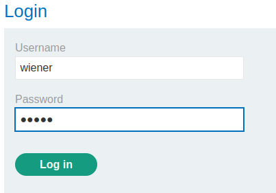

### SameSite Lax bypass via method override : PRACTITIONER

---

###### Solving this lab from Burp's browser.

Given credentials `wiener:peter` and logging in with the given credentials.



We see this page.


We know that the update email is vulnerable to CSRF.
- Capturing a `POST` request via BURPSUITE PROXY HTTP history while updating the email address.


We observe that we can perform CSRF as there is an action (changing email), there are no unpredictable parameters, and user session is tracked via cookies.
- We also don't see any SameSite cookie here, nor in any other previous request, therefore, we can conclude that it is set to `Lax` by default.

> To abuse `Lax` restriction, we need to send a `GET` request in our CSRF attack, and it must be a top-level navigation, like clicking on a link.

1. Change the request method to `GET` in BurpSuite Repeater.
	* Right click on the request and change its method.


It doesn't work. Trying to add the `_method` parameter and set it to `POST`.


We see that it works.
- Now we have a `GET` request that the browser sees as `POST`.

2. Craft a URL that the user clicks on that performs this request.

``` HTML
<script> 
	document.location = 'https://0ac4001004b9c1ad82326a8300ca003d.web-security-academy.net/my-account/change-email?email=newminsy@mins.com&_method=POST'; 
</script>
```
- Set the URL and PATH to the ones in the `GET` request above.

> Adding this payload to the exploit server.


Storing and viewing this exploit we see that we changed the email.
- Delivering the exploit to victim with a new email address completes the lab.

##### Summary

The CSRF attack wont work normally because there is `SameSite=Lax`.

What this does is that cookies, such as the session cookie, will not be transferred between the URL request we sent in the payload, and the browser.

Previously, the user would login, and the session cookies would be set and the attack would work normally.

Now, the cookies aren't readable by the request we send because its from a different site.

To overcome this, we needed to bypass the `Lax` restriction by issuing the payload as a `GET` request, and making it a link that the user clicks on.

---
