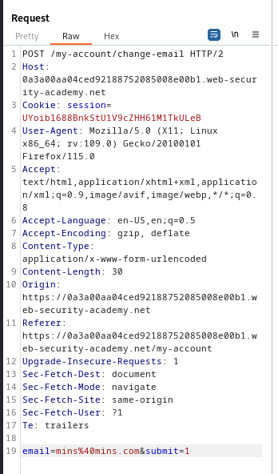
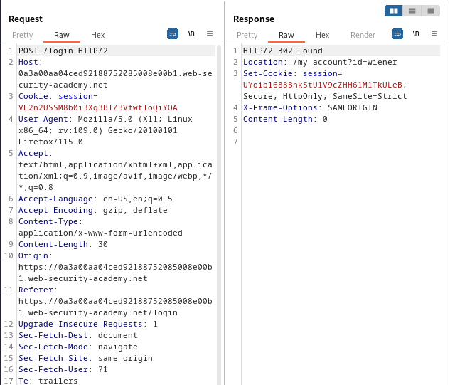
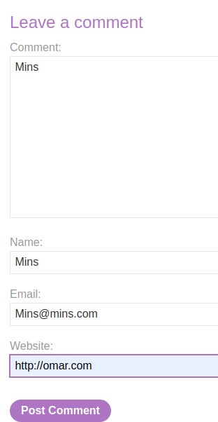
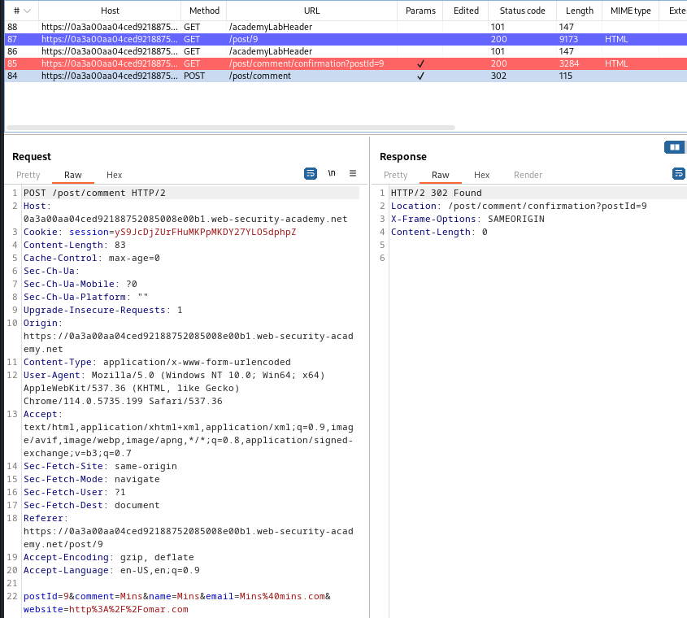
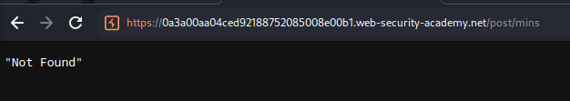
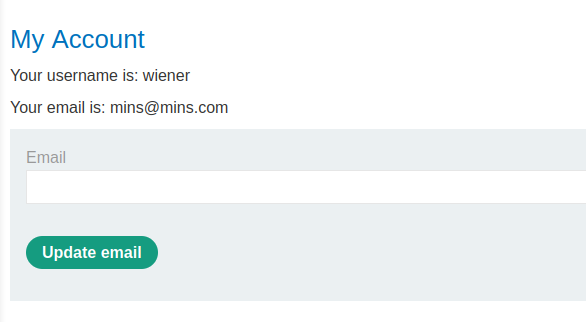

### SameSite Strict bypass via client-side redirect : PRACTITIONER

---


> Given credentials `wiener:peter`.

> Logging in with the given credentials.


> We see this page.


> We know that the update email is vulnerable to CSRF.
> Capturing a `POST` request via BURPSUITE PROXY HTTP history while updating the email address.



> We see that there are no unpredictable parameters, using cookies to handle user sessions, and there is an action to change emails.
> We need to check if there are any `SameSite` restrictions in any of the previous requests and responses to determine the restriction level.



> In the `POST` login request, the server responds with the `SameSite=Strict` attribute.
> Therefore, no cookies will be read through cross-site requests.

> To bypass, we need to find some redirecting functionality on the webpage that has its target url controlled by user input.
> Going to any post and adding a comment.



> Posting the comment, we see multiple requests, and a redirection.



> The `POST` request has multiple parameters, included is the `postId` hidden parameter.
> After submitting, the red `GET` request is sent and a confirmation page is shown with the target URL controlled by the `postId` parameter.
> 3 Seconds later, another `GET` request takes place that returns the user to the page that is also controlled by the `postId` parameter.

> We can understand it better by viewing the javascript source code responsbile for this redirect.
> `commentConfirmationRedirect.js`
``` javaScript
redirectOnConfirmation = (blogPath) => {
    setTimeout(() => {
        const url = new URL(window.location);
        const postId = url.searchParams.get("postId");
        window.location = blogPath + '/' + postId;
    }, 3000);
}
```

> If we change the value of the `postId` in the red `GET` request, we will be redirected after 3 seconds to the `/post/<post-id>` page.
> Trying this theory out.

> Changing the value of the `postId` in the page that is visible for 3 seconds to `mins` and then observe where the application redirects us.


> We get the normal confirmation page, and then after 3 seconds.



> We are taken to the `/post/mins` page so we can change where this redirects to.
> A redirect means that we are issuing a `GET` request, so if we manage to redirect to the change email functionality, we are issuing a `GET` request to perform that action.
> If we just send for the change email path, it won't work as it is not originating from the same site, but a redirect is originating from the same site.

> The request to change an email is:


> The path is `/my-account/change-email`, which is where we should try to redirect.
> We know that the redirect path is set in the request with path `/post/comment/confirmation?postId=x` and it takes us to `/post/x`.

> So what we want to change is the `x`, and setting it to go and change the email. To do that, we get the path to the change email request found in the `POST` request.

```
/post/comment/confirmation?postId=../my-account/change-email?email=mins%40mins.com%26submit=1
```
>Added the `../` to go back to the root directory and then access the `my-account` page.
>The `%26` is the URL encoded version of the `&`.

> We get the comment posted page, and then 3 seconds later, we are redirected to the `my-account` page with the email changed.



> Therefore, we now know that we can change the email through the redirection.
> The next step is to craft the CSRF HTML payload that when clicked, will send the request to the redirection to change the email.

```HTML
<script> 
	document.location = "https://0a47003204d07c2580a72b8c00190027.web-security-academy.net/post/comment/confirmation?postId=../my-account/change-email?email=MINSO%40mins.com%26submit=1"
</script>
```

> Adding this exploit to the exploit server, storing it, and then delivering to victim to complete the lab.

---
