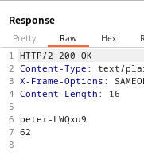

### OS command injection, simple case : APPRENTICE

---

> With BURPSUITE PROXY HTTP history tab open, go to a product and check its stock.


> Capture the `POST` request that is sent when the `Check Stock` button is sent.


> For OS command injections, we check both parameters to see if they are vulnerable.
> Testing `productId`, we add any of the shell operators: `&`, `&&`, `|`, `||`, and then the `whoami` command.

> Trying the `&` character.
```
productId=1 & whoami &storeId=1
```
> The first `&` is the character we added, the second `&` indicates the second parameter storeId.


> Didn't work, trying to URL encode the payload instead.
```
productId=1+%26+whoami+&storeId=1
```


> We see that the `whoami` command was read, and that there is a possibility of our command being executed as a shell command.
> Moreover, a script `/home/peter-LWQxu9/stockreport.sh` is output, which we can use in our attack.

> Trying the second variable `storeId`.
```
productId=1&storeId=1 & whoami
```
> Doesn't work, so trying to URL encode it.
```
productId=1&storeId=1+%26+whoami
```



> It works, the `whoami` command result is output.

> Trying the other operators:
```
productId=1&storeId=1 S| whoami
```


> Now that we know this is vulnerable to command injection, we can try reading the script using `cat`.
```
productId=1&storeId=1 S| cat /home/peter-LWQxu9/stockreport.sh
```


> This takes 2 variables, `storeId` and `productId`, and this is where we injected.
> This is why when we injected in the first variable, it said `$2` was missing, because our injection was in `$1` and skipped or bypassed the second variable.

---
