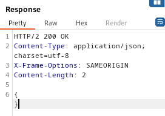

### Blind OS command injection with time delays : PRACTITIONER

---

> Head to the submit feedback page.


> Using BURPSUITE PROXY HTTP history, capture the `POST` request after filling in the form.


> Trying the 4 operators, `&, |, &&, ||` has no effect, only this response is returned.



> It is a blind injection. So we need to trigger a time delay.
> Trying this payload in all the parameters.
```
& ping -c 10 127.0.0.1 &
```
> But using the URL encoded version.
```
%26%20ping%20-c%2010%20127.0.0.1%20%26
```

> The time delay is only witnessed in the email parameter.


> But for all other parameters, the time delay isn't working and the website responds with an empty response.

> This infers that for the email, there is a shell command that sends an email.
> We injected inside this shell command, and caused the email to be sent aftera delayed time of 10 seconds.

---
