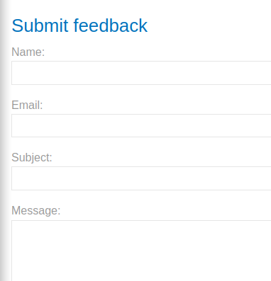
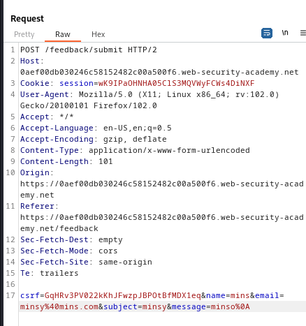
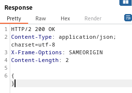
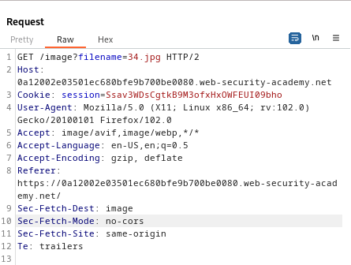
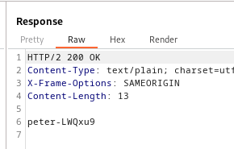

### Blind OS command injection with output redirection : PRACTITIONER

---

Head to the submit feedback page.



Using BURPSUITE PROXY HTTP history, capture the `POST` request after filling in the form.



Trying the 4 operators, `&, |, &&, ||` has no effect, only this response is returned.



> It is a blind injection, we need to write to a file (redirect output), and then view that file.

> The writable directory: `/var/www/images`.

Similar to [[Portswigger/Command Injection/Lab 2|Lab 2]], the `email` parameter is the one containing a shell command that can get injected into.
```
& whoami > /var/www/images/mins.txt &
```
- This writes the output of the `whoami` command into the `mins.txt` file in the writable folder called `images`.

Using the URL encoded version.
```
%26+whoami+>+/var/www/images/mins.txt+%26
```

> Now we have theoretically written to the file `mins.txt` the output of the `whoami` command. To check that, we need to get a request that loads files from the `images` folder.

Go to any product, and capture the `GET` request that loads the image of the product.




This request talks directly to the `/images` folder, so we can change the `filename` parameter to `mins.txt` and read its contents.
```
GET /image?filename=mins.txt HTTP/2
```
- This is the new header of the request.

> Sending this request, we get the response with the file contents containing the output of the `whoami` command.



---
