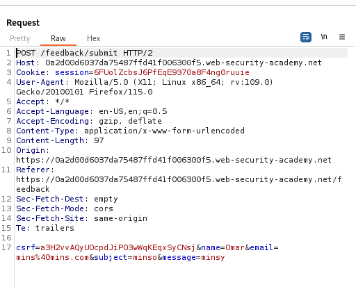
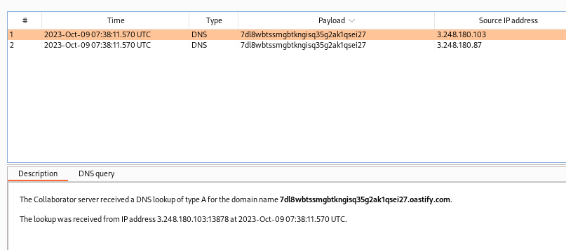

### Blind OS command injection with out-of-band interaction : PRACTITIONER

---

Heading to the feedback submission page with BurpSuite PROXY HTTP History running.


After submitting feedback, open the sent `POST` request and send it to repeater for further analysis.



We need to trigger an out of band interaction using one of these parameters.
- This will be done by performing a dns lookup of the burp collaborator domain.

Inserting this payload into all the parameters one by one.
```
mins||nslookup+<BURP-COLLAB-PAYLOAD>||
```
- The <BURP_COLLAB_PAYLOAD> can be added by right clicking and then choosing add the burp collaborator payload.

> Using the `email` parameter is the only one that works.

Sending the request, we get no response, but if we check the collaborator, we see that there was a post request sent with a DNS lookup.



> Therefore this proves that we can execute commands but it is a blind injection point. We checked its existence through the out of band interaction with another domain that we have control over.

---
