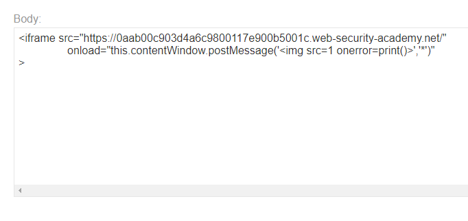

### DOM XSS using web messages : PRACTITIONER

---


> We are looking for any script that is misconfigured and contains a sink.
> Scanning through the website source code we see this script that deals with web messages.

```HTML
<!-- Ads to be inserted here -->
<div id='ads'>
</div>
<script>
	window.addEventListener('message', function(e) {
		document.getElementById('ads').innerHTML = e.data;
	})
</script>
```

> What this does, is that listens for messages, and then sets the HTML content of the `div` with `id=ads` to whatever the message content is.
> We also see that there is no cross-origin or cross-site protection against messages, and there is no message content validation.
> Since the sink in this case puts HTML code, we cannot send `<script>` tags inside the message as this doesn't make sense.
> We need to send an HTML tag, and create an XSS attack through its attributes.

```HTML

```

> To send a message, we can use an `iframe` that once loads, sends a message with the above payload.

```HTML
<iframe src="https://0aab00c903d4a6c9800117e900b5001c.web-security-academy.net/" 
		onload="this.contentWindow.postMessage('','*')"
>
```
> We also specify that this message is to be sent to all origins using `*`.

> Pasting this `iframe` in the exploit server.



> Viewing the exploit we see that we get the print page.
> Storing it and delivering to victim completes the lab.

---


