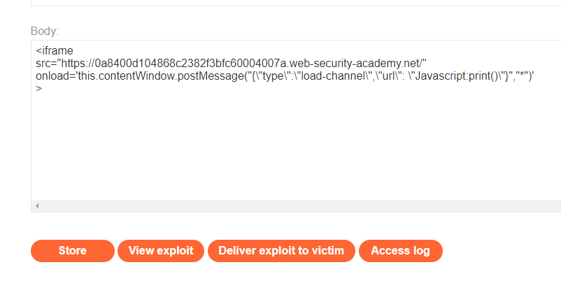

### DOM XSS using web messages and JSON.parse : PRACTITIONER

---


> We are looking for any script that is misconfigured and contains a sink.
> Scanning through the website source code we see this script that deals with web messages.

```HTML
<script>
	window.addEventListener('message', function(e) {
	    var iframe = document.createElement('iframe'), ACMEplayer = {element: iframe}, d;
	    document.body.appendChild(iframe);
	    try {
	       d = JSON.parse(e.data);
	    } catch(e) {
		    return;
	    }
	    switch(d.type) {
	        case "page-load":
	            ACMEplayer.element.scrollIntoView();
	            break;
	        case "load-channel":
	            ACMEplayer.element.src = d.url;
	            break;
	        case "player-height-changed":
	            ACMEplayer.element.style.width = d.width + "px";
	            ACMEplayer.element.style.height = d.height + "px";
	            break;
	    }
	}, false);
</script>
```

> What this script does:

1. When a message is received, the code creates an `<iframe>` element and an object named `ACMEplayer` which holds a reference to the iframe.
2. The iframe is appended to the `<body>` of the document.
3. The received message data is attempted to be parsed as JSON. If parsing is successful, the data is stored in the variable `d`. If parsing fails, the code exits. 
4. The code then uses a switch statement to check the value of `d.type` and performs different actions based on its value:
    - If `d.type` is `"page-load"`, the code scrolls the iframe into view.
    - If `d.type` is `"load-channel"`, the iframe's `src` attribute is set to the URL provided in `d.url`.
    - If `d.type` is `"player-height-changed"`, the code sets the iframe's width and height based on the values in `d.width` and `d.height`.

> We see that there is a sink, and that is setting the `src` of the `ACMEplayer` iframe, and its source is simply `d.url`, which we can change.
> Therefore, there exists a taint flow, and a DOM based vulnerability.

> Therefore, our goal is to trigger the second case in the switch statement, that is to change the URL of the iframe which is embedded in the HTML of the document.
> The URL we can change it and inject some javascript into it to execute the `print()` function as desired.
> However, since the message data is first parsed as JSON, we need to send it in a JSON format.

> We see that the `select` statement chooses based on `d.type`, then we should in the JSON data a key called `type` and set its value to `load-channel`.
> Furthermore, we see that it sets the `src` to `d.url`, therefore, we need to pass a key called `url` and set its value to the javascript payload:
```JavaScript
Javascript:print()
```

> The message we aim to send should look like this:
```JSON
{
	"type": "load-channel",
	"url": "Javascript:print()"
}
```

> To send messages, we create an `iframe`, set its `src` to our lab, and change the `onload` attribute to send a message. 
> When the user clicks on the link that contains the `iframe` which we will send via the exploit server, the `iframe` loads, sends the message, which executes our javascript.
> The content of this message should be the JSON object above.

```HTML
<iframe
src="https://0a8400d104868c2382f3bfc60004007a.web-security-academy.net/"
onload='this.contentWindow.postMessage("{\"type\":\"load-channel\",\"url\": \"Javascript:print()\"}","*")'
>
```
> Basically we added `\` before the `"` inside the message in order to not break out of the string, since we are using multiple instances of double and single qoutes.
> Pasting this payload in the exploit server.



> Storing and viewing it shows the print screen.
> Delivering it to victim completes the lab.

---

