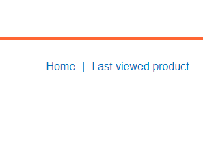
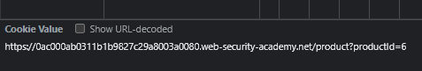
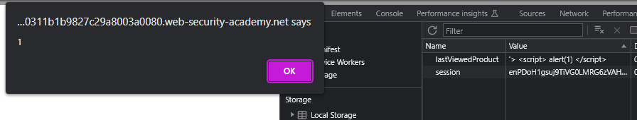

### DOM-based cookie manipulation : PRACTITIONER

---

> We are looking for any script that is misconfigured and contains a sink.
> Scanning through the website source code of a product, we see at the bottom a script:

```JavaScript
<script>
document.cookie = 'lastViewedProduct=' + window.location + '; SameSite=None; Secure'
</script>
```

> What this does is that creates a cookie called `lastViewProduct` and sets its value to the `window.location`. 
> `window.location` is the URL, and we can control that URL.
> Hence, we have a sink that can have its value modified by a source, therefore, we have a taint flow and a DOM based vulnerability.
> It also adds some security configurations on the cookie so that no cross-site request can access this cookie.

> This script gets executed once we view a product, and once we go back to the home page, we see a new button shows up at the top.



> Clicking on it redirects us, and takes us to the product we were just at.
> We can modify where this redirect takes us, since it is controlled by the cookie.

> If we change the value of the cookie to another product through the developer tools.
> Changing the productId to 6.



> If we refresh the page and then click on the `last viewed product` buttom in the home page, we are taken to a different product, the one with `productId=6`.
> This confirms we can change where the redirect takes us, but this is only same-site.

> Next step is to see if we can break out of the script and inject our own javascript and execute it.
> Changing the value of the cookie to:

```
'> <script> alert(1) </script>
```

> What this does is this:

``` JavaScript
<script>
	document.cookie = 'lastViewedProduct='url?productId='> 
		<script> alert(1) </script> 
	'; SameSite=None; Secure'
</script>
```
> We close off the qoute and add a new `script` element. If we dont close off the qoute, it will be read as part of the string.

> Refreshing the page we see an alert pop up.



> Now that we can inject and execute javascript, lets craft a URL, that when clicked, does this all for us.
> This link can be sent to any user, and if they click on it, it modifies the cookie value to that javascript and alerts if the user clicks on `last viewed product` button.
> Later, we will make it so that it automatically refreshes to load the cookie.

> We click on any product so that we are in the presense of the script.
> Modifying the URL to:
```
https://0af4003d039c3cb880c5b724006d00ec.web-security-academy.net/product?productId=1&'>%20<script>%20print()%20</script>
```
> The `%20` is the url encoded space.

> Pasting this payload and refreshing, we see the print.
> Therefore, we managed to access the sink and execute javascript.

> In order to make it a craftable link that we can send to any user, we go to the exploit lab, and create an `iframe` element.
> This element when clicked, loads up the page with the URL we crafted above.
> There, we can add an event listener so that once the link is clicked, it refreshes to store the cookie to execute the javascript.

> Heading to the exploit server and pasting this payload in the body.
``` HTML
<iframe 
src="https://0af4003d039c3cb880c5b724006d00ec.web-security-academy.net/product?productId=1&'>%20<script>%20print()%20</script>"
onload="this.src=https://0af4003d039c3cb880c5b724006d00ec.web-security-academy.net/"
>
```
> Basically this changes the `src` of the page once the iframe reloads to automatically set the cookie.
> Opening the home page now shows the print screen, and the lab is complete.

---
