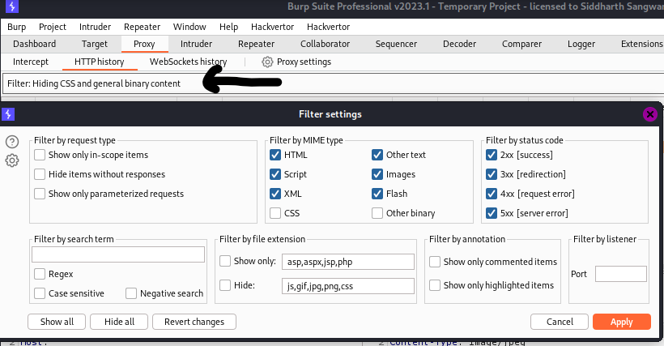
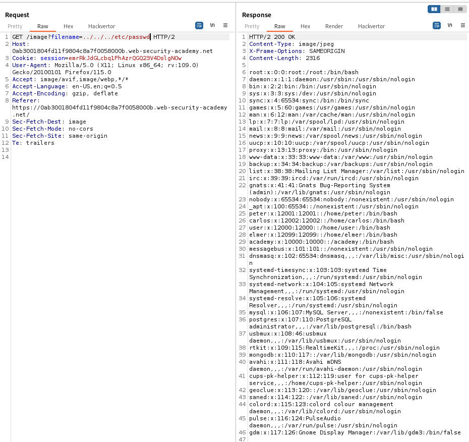

### File path traversal, simple case : APPRENTICE

---

Opening the website and having Burp Suite HTTP History tab open, we do not see any images being loaded.
- To show images, we can press on the Filter and show images.



Now, we can see all the images being fetched.
- Opening a request for any image, we see the following:


Now, we can try to read the `/etc/passwd` file by jumping back 3 times to get to the root directory:

```
../../../etc/passwd
```



> It works, and we get the `/etc/passwd` file, completing the lab.

---
