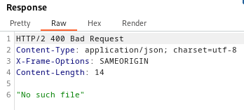

### File path traversal, simple case : APPRENTICE

---

> Burpsuite doesn't show images and filters their requests. This is a turnaround. 
> If your burpsuite shows the image requests, then simple navigate to one of the `GET` requests to get an image.
> Continue with this walkthrough at the `GET` request image.

##### Burpsuite Filtering Image Requests.
> Open developer tools and choose one of the images.


> The path after the question mark could be possibly changed.
> To check, right click on that src and choose open in new tab.


> This opens the image in a new tab. Open that request in BURPSUITE PROXY through the HTTP history tab.

##### CONTINUE HERE


> Now that we have the `GET` request, we can modify the value of the `filename` parameter to see if we can navigate through the file system.
> This can be done by sending that request to BURPSUITE REPEATER.

> We try going up 1 directory and looking for `/etc/passwd`.
```
../etc/passwd
```



> Doesn't work, so trying another upward jump.
```
../../etc/passwd
```


> Doesn't work, so trying another jump.
```
../../../etc/passwd
```


> It works, and we get the `/etc/passwd` file, completing the lab.

---
