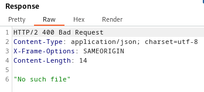

### File path traversal, traversal sequences blocked with absolute path bypass : PRACTITIONER

---

Similar to [[Portswigger/Directory Traversal/Lab 1|Lab 1]], burpsuite filters images.

> To overcome this, go to PROXY HTTP history, and press on `Filter: Hiding CSS, image ...`


- And press on show all at the bottom.

Refresh the lab page and see all `GET` requests with images.
- Choose one to play with and send to repeater.


> Change the value of the `filename` parameter.
```
../etc/passwd
```



> It didn't work, i kept jumping above but still nothing. (expect 3 since `/var/www/images`)

This makes me think that the traversal sequences are blocked.
- Using absolute paths.
```
/etc/passwd
```


> We get the `/etc/passwd` file and complete the lab.

---
