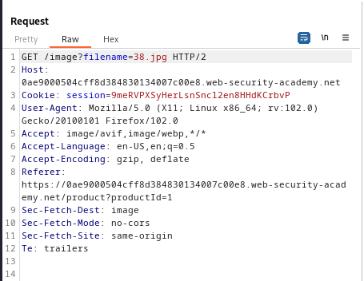

### File path traversal, traversal sequences stripped with superfluous URL-decode : PRACTITIONER

---

Similar to [[Portswigger/Directory Traversal/Lab 1|Lab 1]], burpsuite filters images.

> To overcome this, go to PROXY HTTP history, and press on `Filter: Hiding CSS, image ...`


- And press on show all at the bottom.

Refresh the lab page and see all `GET` requests with images.
- Choose one to play with and send to repeater.



Change the value of the `filename` parameter.
- We want to jump upwards, but the `../` sequence is blocked.
- We can try using URL encoding to bypass this block.
```
%2e%2e%2fetc/passwd
```

> The sequence `../`  is encoded to `%2e%2e%2f`.


Keep adding more jumps until it works.
- It doesn't seem to work.

So lets try double encoding, where the sequence `../` is encoded to `%252e%252e%252f`.
- Keep adding more of them until it works. (expect 3 since `/var/www/images`)

> It works at 3 jumps.

```
%252e%252e%252f%252e%252e%252f%252e%252e%252fetc/passwd
```


> This shows the `/etc/passwd` file and completes the lab.

---
