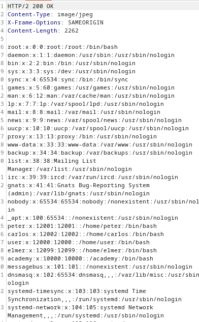

### File path traversal, validation of start of path : PRACTITIONER

---

Similar to [[Portswigger/Directory Traversal/Lab 1|Lab 1]], burpsuite filters images.

> To overcome this, go to PROXY HTTP history, and press on `Filter: Hiding CSS, image ...`


- And press on show all at the bottom.

Refresh the lab page and see all `GET` requests with images.
- Choose one to play with and send to repeater.


> We see that it expects the `/var/www/images` path at the beginning.

We can add the traversal sequence `../../../` after the required initial portion, and go to `/etc/passwd`.
```
/var/www/images/../../../etc/passwd
```
- Adding that to the value of the `filename` parameter.



> We see the `/etc/passwd` file and the lab is complete.

---
