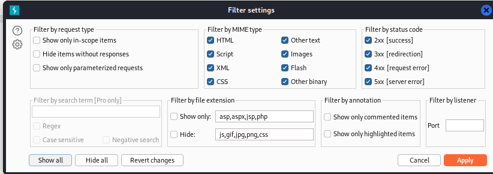

### File path traversal, validation of file extension with null byte bypass : PRACTITIONER

---


> Similar to [[Portswigger/Directory Traversal/Lab 1|Lab 1]], burpsuite filters images.
> To overcome this, go to PROXY HTTP history, and press on `Filter: Hiding CSS, image ...`


> And press on show all at the bottom.

> Refresh the lab page and see all `GET` requests with images.
> Choose one to play with and send to repeater.


> To validate the file extension, we use the null byte `%00`.
> Changing the value of the `filename` parameter, we add the traversal sequence (expect 3 since `/var/www/images`).
```
../../../etc/passwd%00.jpg
```
> Anything after the `%00` is ignored by the server, so we add the `.jpg` extension as needed by the web application check to bypass it.


> We see the `/etc/passwd` and the lab is complete.

---
