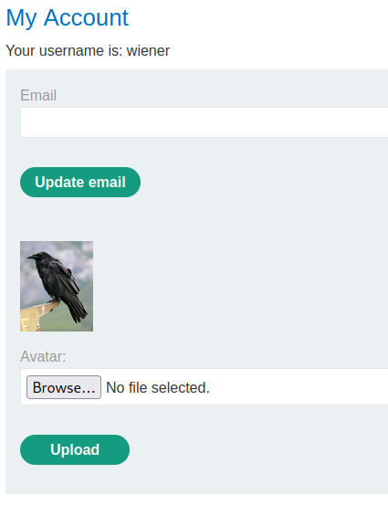
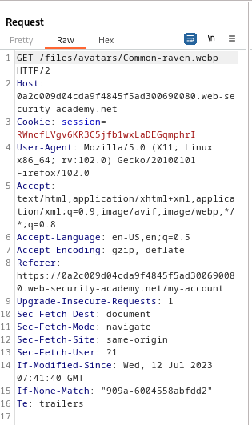
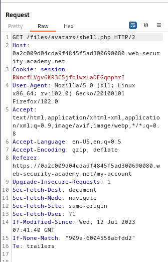
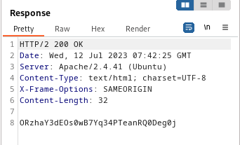

### Remote code execution via web shell upload : APPRENTICE

---

> We need to read the contents of the file at `/home/carlos/secret`.
> Given login credentials `wiener:peter`.

> Logging in as wiener.


> We see this my-account page.


> We see there is a file upload in the `browse` button.
> Uploading an actual picture to monitor the websites behaviour while having BURPSUITE PROXY HTTP history on.


> Our account page now looks like this:



> Viewing this image in a new tab and observing the request.



> We see that the images are stores in the `/files/avatars/` directory.
> So the browse button uploads files into this directory.

> So now if we upload a shell that reads the contents of the `/home/carlos/secret` file using the browse button.
```PHP
<?php echo file_get_contents('/home/carlos/secret'); ?>
```
> File is called `shell.php`.

> Sending the `GET` request above to BURPSUITE REPEATER and changing the path to our `shell.php` file.



> Sending this request we get a response with the contents of the required file.



> Copying this value:
```
ORzhaY3dEOs0wB7Yq34PTeanRQ0Deg0j
```

> Submitting it in the submit solution box completes the lab.

---
