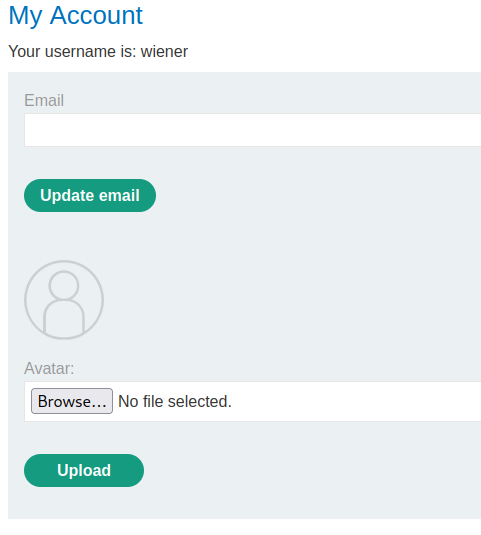

### Web shell upload via Content-Type restriction bypass : APPRENTICE

---

> We need to read contents of the `/home/carlos/secret` file.
> Given login credentials `wiener:peter`.


> Logging in as wiener.


> We see this my-account page.



> We see there is a file upload in the `browse` button.
> Trying to upload a php shell to obtain the secret file, while having BURPSUITE PROXY HTTP history open
```PHP
<?php echo file_get_contents('/home/carlos/secret'); ?>
```
> `shell.php`.

> We get this response.


> We see that we cannot upload any files that are not of content type: `image/jpeg` or `/png`.
> Sending this `POST` request to BURPSUITE REPEATER and modifying the content type in the request.


> We modified the content type in the request in line 21, and we see that it is accepted.

> Now, we need to navigate to where the shell is on the website.
> If we go to the my-account page and click on where the image should be, we are supposed to open the php shell.


> Right clicking on the image and opening in new tab.


> Displays the secret, copying it:
```
JFcv88hrJ1MWrogWt7rTPox3FGd2kgAd
```

> Placing it in the submit box to complete the lab.

> We couldve went to where the script is using the same technique as [[Portswigger/File Upload Vulnerabilities/Lab 1|Lab 1]].
> Upload an actual image, capture the `GET` request via BURPSUITE by removing the filters, see the path of the image, and change the filename to `shell.php`. 

---
