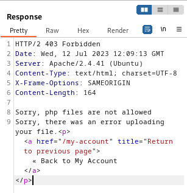
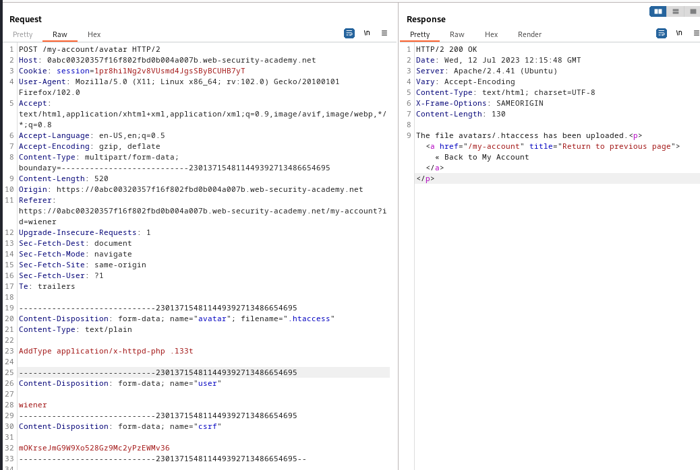
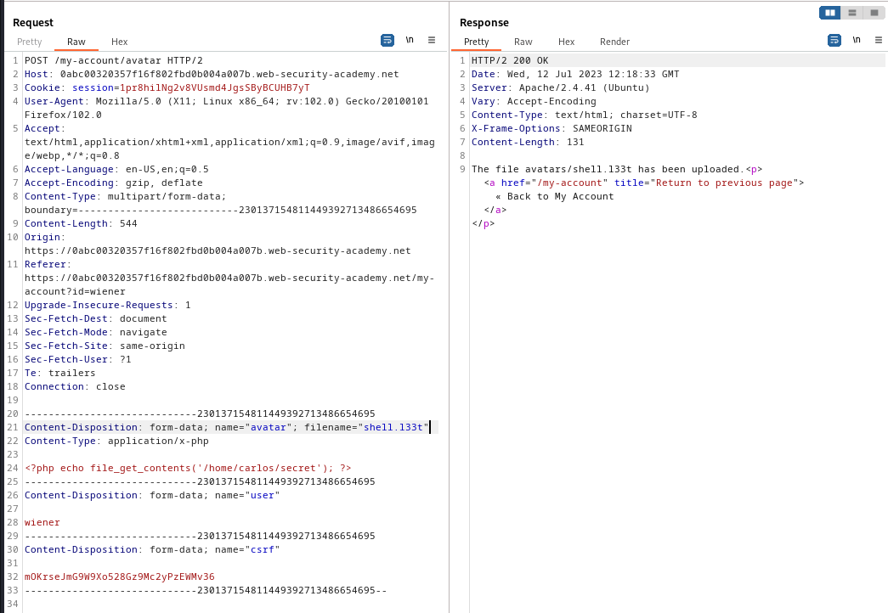
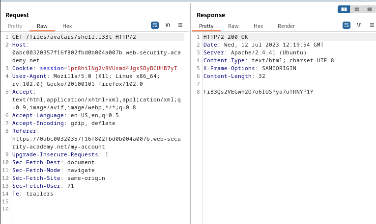

### Web shell upload via extension blacklist bypass : PRACTITIONER

---


> We need to read contents of the `/home/carlos/secret` file. Given login credentials `wiener:peter`.

Logging in as wiener.


We see this my-account page.


Trying to upload a PHP shell to obtain the secret file, while having BURPSUITE PROXY HTTP history open
```PHP
<?php echo file_get_contents('/home/carlos/secret'); ?>
```
- This is called `shell.php`.

We get this response from the `POST` request.



> This is a Apache server as observed by the headers in the response. We can try to modify the `.htaccess` file to match any file extension to an executable MIME type, and then upload a file with the newly configured extension.

To do that, we go to the `POST` request that uploads the `shell.php` file and modify its body.
1. Change the filename to `.htaccess`.
2. Change the Content-Type to `text/plain`.
3. Change the actual payload to `AddType application/x-httpd-php .l33t`.



> Now, we matched the `.l33t` extension to be executed similar to `php`.

Trying to upload the shell once again but this time with the `.l33t` extension in the `POST` request.



> The file is uploaded normally.

Trying to access the shell by going to the my-account page and opening the `GET` request responsible for loading the image slot.



> We see the script has executed, and the secret returned. Copying it to submit and complete the lab.
```
FiB3Qs2VEGwh2O7o6IUSPya7ufRNYP1Y
```

---
