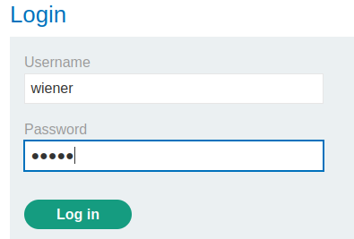
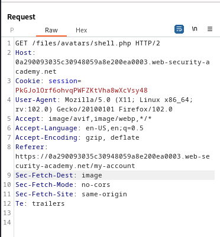

### Web shell upload via race condition : EXPERT

---

> We need to read contents of the `/home/carlos/secret` file.
> Given login credentials `wiener:peter`.


> Logging in as wiener.



> We see this my-account page.


> Trying to upload a php shell to obtain the secret file, while having BURPSUITE PROXY HTTP history open
```PHP
<?php echo file_get_contents('/home/carlos/secret'); ?>
```
> `shell.php`.

> We get this response.


> We know that the server uploads the file, and then after performing checks, it then returns the forbidden response and deletes it.
> We have a short time frame to fetch the contents of the script before it gets checked and removed.

> To do that, first send the `POST` request above to intruder and set the payloads to `NULL payloads` and make it continue indefinitely.


> Then get a `GET` request that fetches the image from HTTP history after visiting my-account.



> And do the same in intruder.


> Then start both attacks, and monitor the `GET` request window.
> We are supposed to see that the `GET` request returns a 200 response meaning the file was found.


> Copying the secret and submitting it completes the lab.
```
olCpaUWO3dYgVhDCgxRNkLvn6TO6eL9f
```

---
