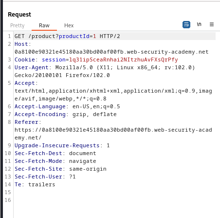
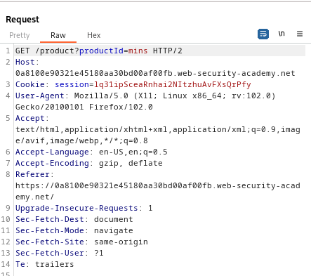
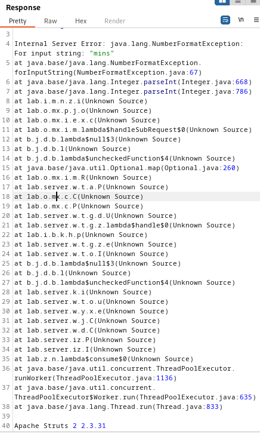

### Information disclosure in error messages : APPRENTICE

---

> Skimming through the website and having BURPSUITE PROXY HTTP history on, see that there is no user injectable point except in 1 request.



> The `productId` parameter can be changed in the `GET` request to fetch an item.
> Fuzzing this parameter, we enter different a string.
```
productId=mins
```



> Hitting send, the server responds with an error message.



> We see the version at the bottom.
```
2 2.3.31
```

> Submitting this in the solution box completes the lab.

---
