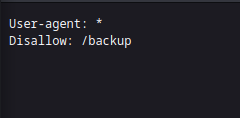
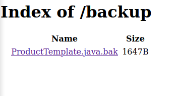
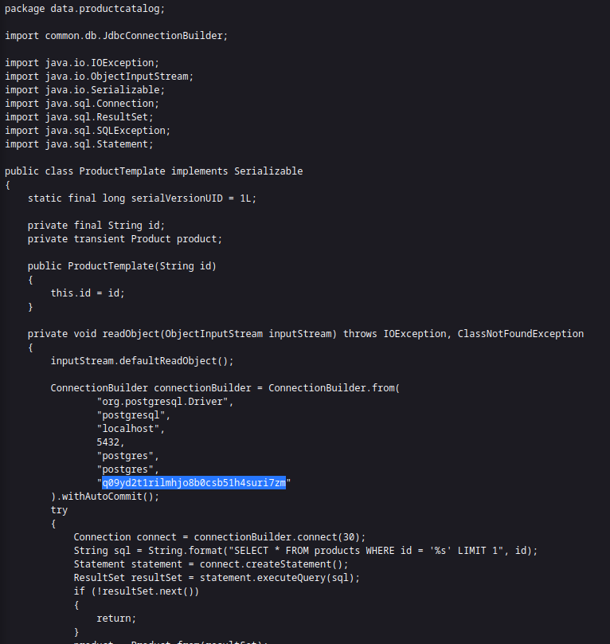

### Source code disclosure via backup files : APPRENTICE

---

> Skimming through the website with BURPSUITE INTERCEPT HTTP history open reveals nothing.
> Trying to access `/robots.txt`.

> See that there is a directory `/backup` that might contain sensitive data.
> Browsing to it.

> Opening that link.

> The password of the database: `q09yd2t1rilmhjo8b0csb51h4suri7zm`.

> Pasting that in the submit box completes the lab.

---
