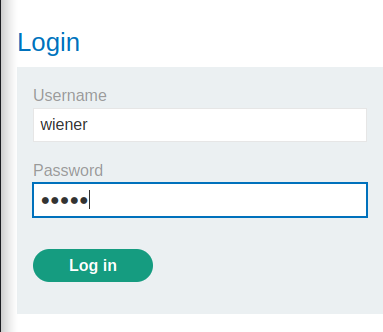
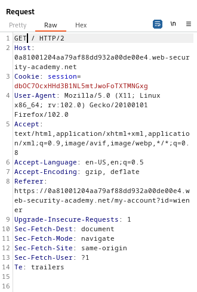
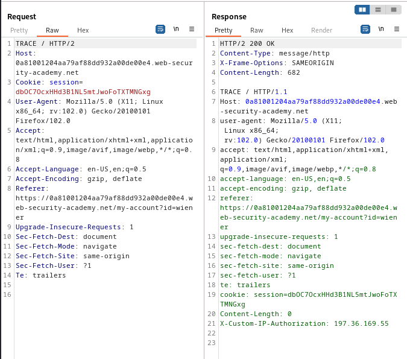
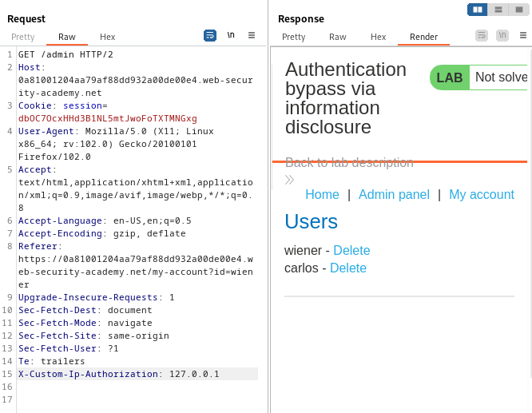
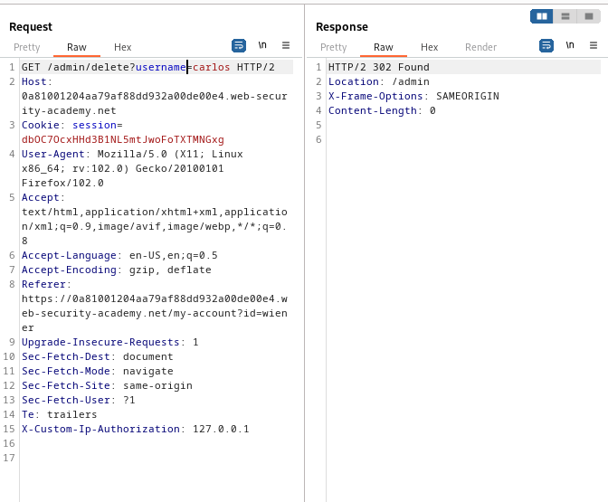

### Authentication bypass via information disclosure : APPRENTICE

---

> Given credentials `wiener:peter`.

> Loggin in as wiener.



> Send the `GET /` request to BURPSUITE REPEATER.



> Replacing the `GET` with `TRACE` to check if there are hidden headers.



> We see the `X-Custom-IP-Authorization` header.
> This checks from where the request originates.
> In order to gain admin privileges, we can try to modify this value to the localhost of the server.

> Adding to the request.
```
X-Custom-IP-Authorization: 127.0.0.1
```

> Trying to access `/admin` at the same time.



> If we remove the `X-Custom-IP-Authorization: 127.0.0.1` header we added, the request wouldn't work as we are not authorized to access the `/admin` page.

> In order to delete carlos, we can change the directory of the request.
```
GET /admin/delete?username=carlos
```



> This completes the lab.

---
