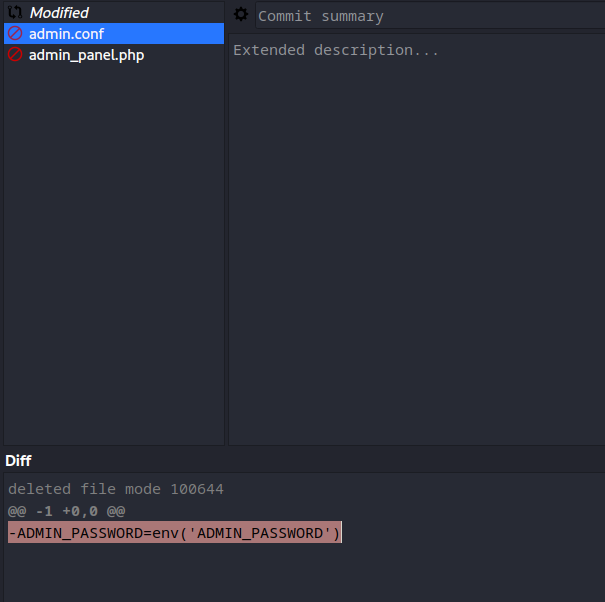
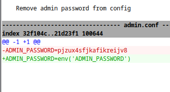
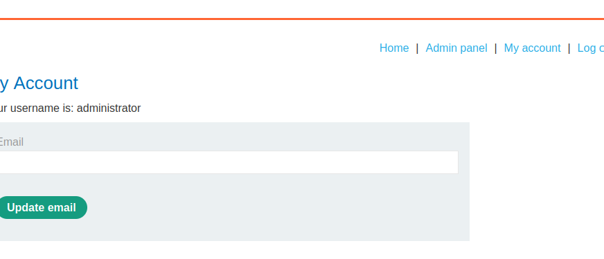
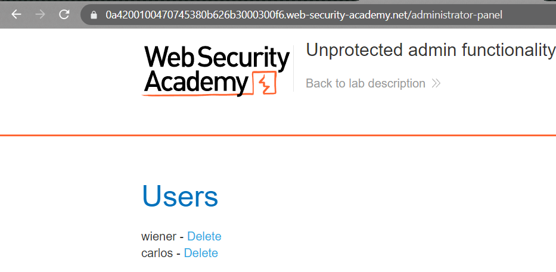

### Information disclosure in version control history : PRACTITIONER

---

Browsing to `/.git/` reveals that a version control was used.
- To better browse through it, download the directory.

``` bash
wget -r https://0a84007a041db86c801bc6b600a10034.web-security-academy.net/.git/
```
- The `-r` flag is for recurisve downloads to download everything.

To view the versions and history of the files, download `git-cola`.
``` bash
sudo apt-get install git-cola
```

Open it by typing in the terminal `git-cola`.
- Choose the directory that was downloaded by `wget` to open in the application.



We see the file `admin.conf`, and the `Diff` states that the admin password was removed. (the minus sign).
- Right clicking on the file and selecting view history.



A new window opens with the changes that were done on the file.
- We see the admin password.
```
pjzux4sfjkafikreijv8
```

Logging in as admin.
```
administrator:pjzux4sfjkafikreijv8
```

Opening the admin panel and deleting the user carlos to complete the lab.





---
