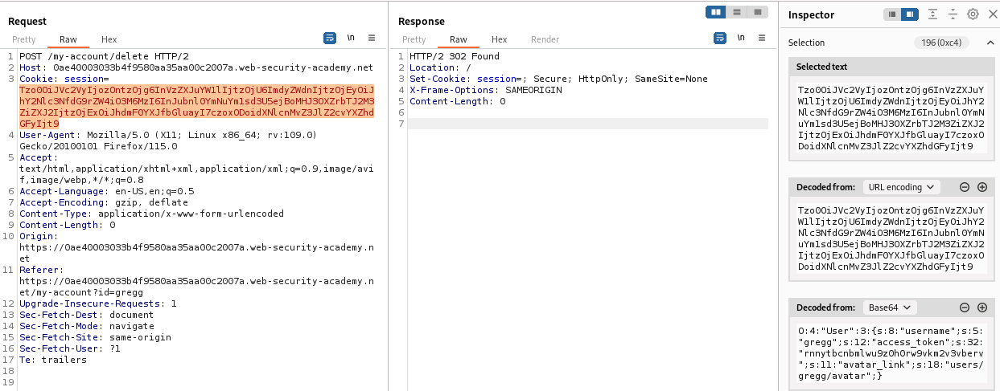
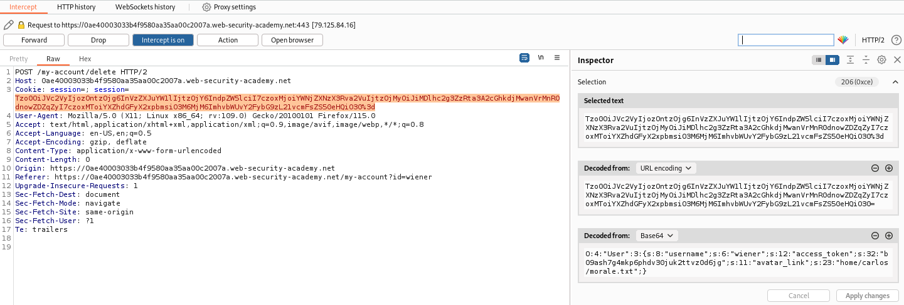

### Using application functionality to exploit insecure deserialization : PRACTITIONER

---

Logging in using the backup account `gregg:rosebud`, and having Burp Suite Proxy HTTP History tab open.


We see that there is a functionality to delete a user, and that there is a `session` cookie present.

Inspecting the session cookie, we see that it is a serialized object:
```
O:4:"User":3:{s:8:"username";s:5:"gregg";s:12:"access_token";s:32:"rnnytbcnbmlwu9z0h0rw9vkm2v3vberv";s:11:"avatar_link";s:18:"users/gregg/avatar";}
```

> The object displays the `username`, the `access_token`, and the `avatar_link` of each user.

What comes to mind, is that when pressing on `Delete account`, this information gets deleted.
- We can use that to delete the file `morale.txt` found in the user `carlos`'s home directory.

> The path of the file we want to delete is: `/home/carlos/morale.txt`.

With HTTP history tab open, press on `delete user`, and capture the request sent.
- We will then modify this request by changing the value of the session token to delete the file we need.



```
O:4:"User":3:{s:8:"username";s:5:"gregg";s:12:"access_token";s:32:"rnnytbcnbmlwu9z0h0rw9vkm2v3vberv";s:11:"avatar_link";s:23:"/home/carlos/morale.txt";}
```
- This is the new session cookie that we will use.
- We need to update also the size of the string, from 18 to 24.

Sending this request doesn't work, I think because I already deleted the user `gregg`.
 - Trying the new user `wiener`, but this time, using Proxy Intercept to modify the session cookie before actually deleting the user.

Logging into `wiener:peter`, and pressing on delete account but with intercept on.
- Changing the session cookie similar to above.



Forwarding the request now, we see that it works, and the lab is completed.

---
