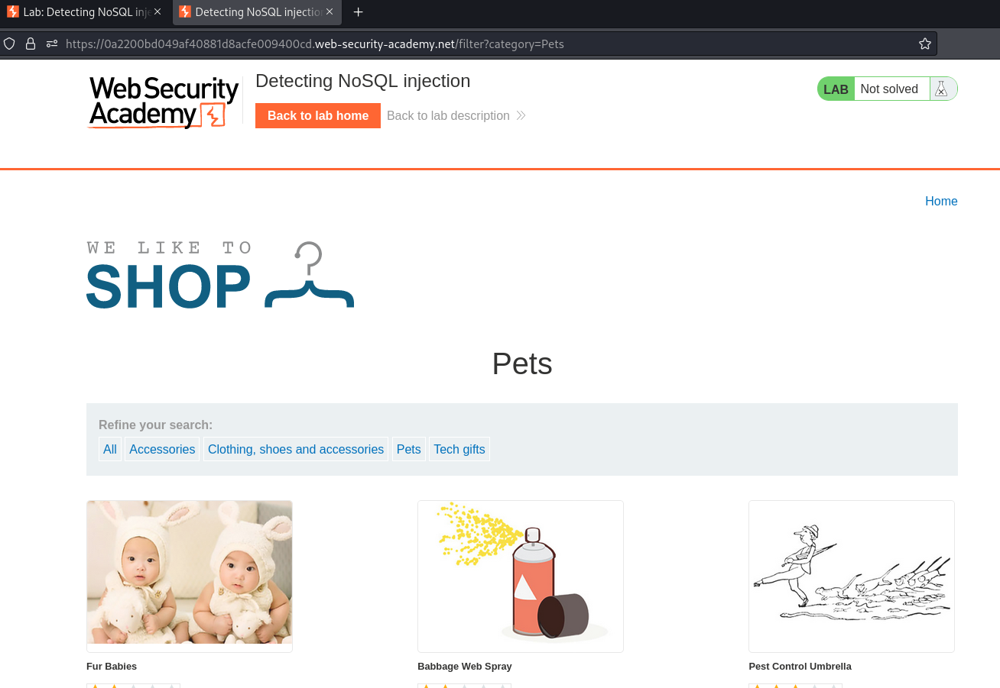
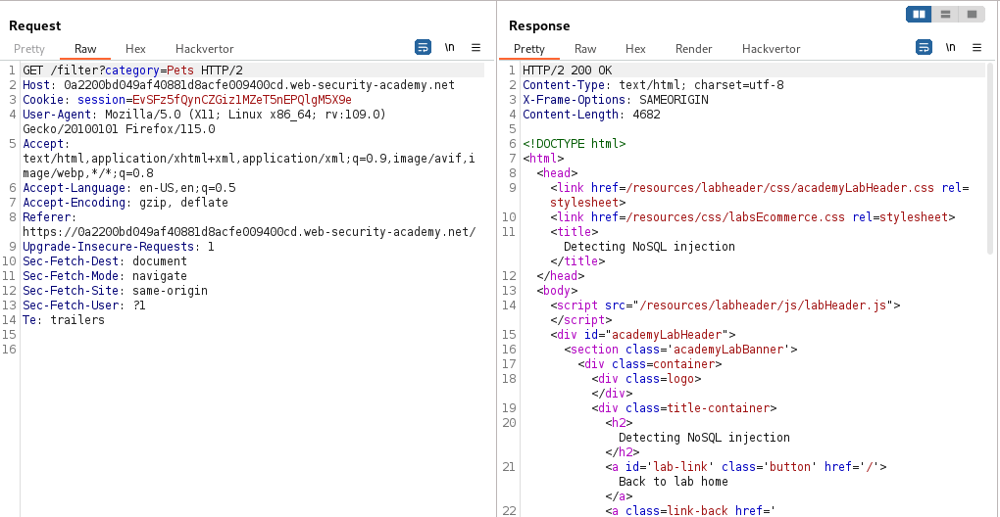
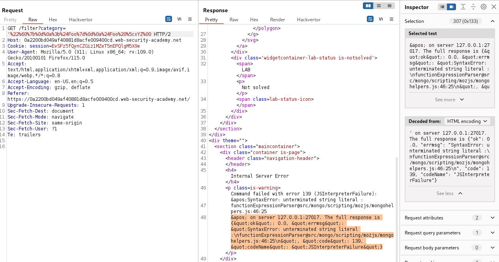
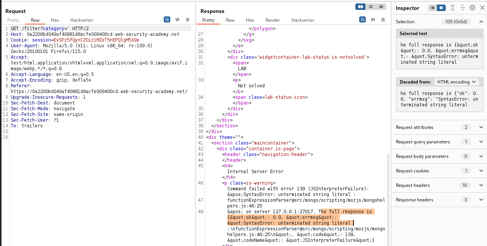
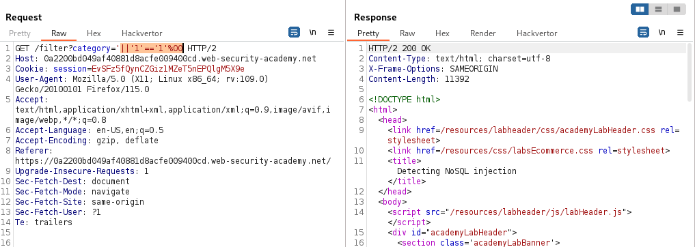

### Detecting NoSQL injection : APPRENTICE

---

The NoSQL database here is MongoDB, and the vulnerable injection point is the `category` parameter.

With Burp Suite HTTP History tab open, click on a category and send the request to repeater.



Observing the request and response.



Trying the injection string for MongoDB:
```
category='%22%60%7b%0d%0a%3b%24Foo%7d%0d%0a%24Foo%20%5cxYZ%00
```

Which is the URL encoded version of:
```
'"`{ ;$Foo} $Foo \xYZ
```
- This contains all injection characters.



We get an error, indicating that one of the injection characters does make a difference.
- The error message says unterminated string literal, so maybe the `'` single quote is important.

Sending a request with only the single quote character and observing the request.



Once the injection character has been identified, it is time to write a query that returns all items from the table.
```
category='||'1'=='1'%00
```
- This query here terminates the server side query with the first quote, then adds an always true condition `'1'=='1'`, and then it terminates the query by adding a null character `%00`.

Sending this request, we see that the response size has increased significantly, implying that more items have been returned.



And the lab is complete.

---
