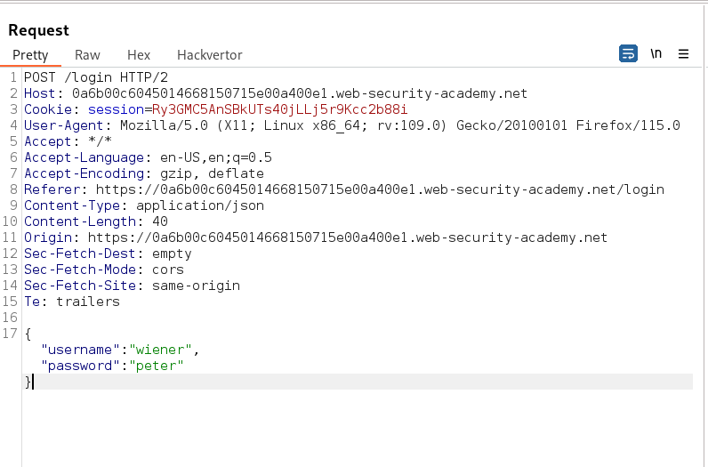
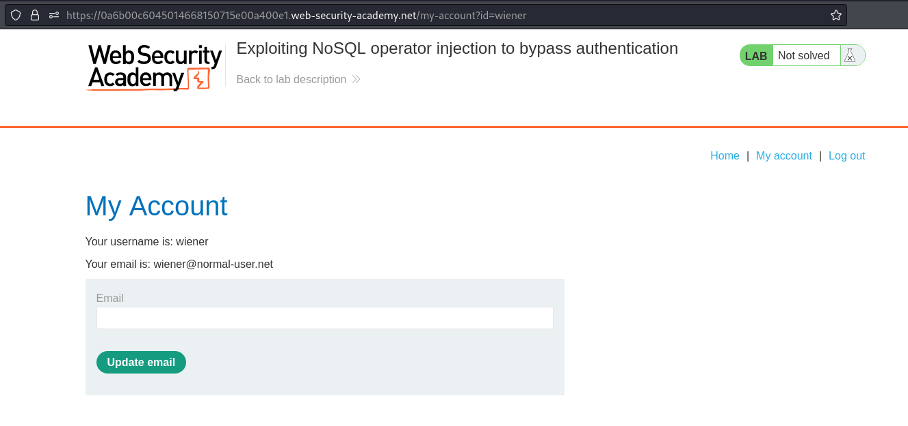
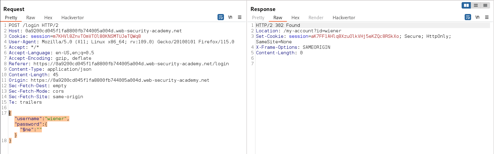
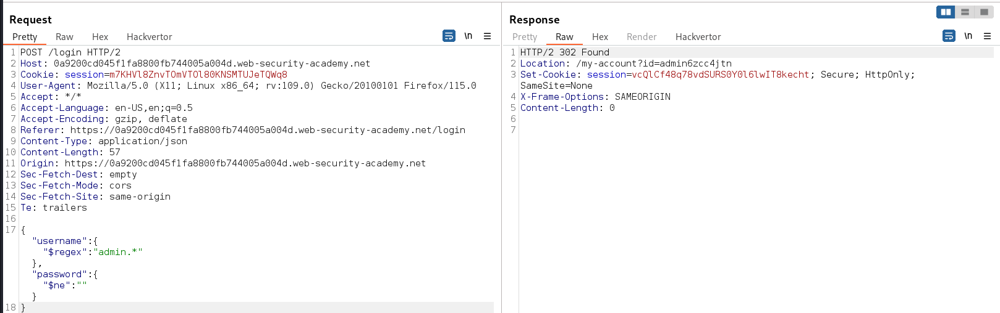
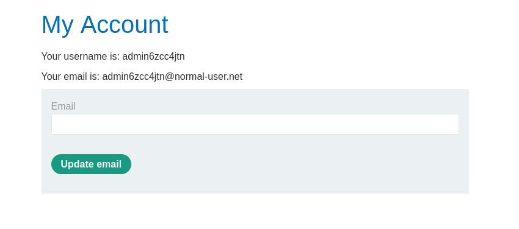

### Exploiting NoSQL operator injection to bypass authentication : APPRENTICE

---

The login functionality of this lab uses MongoDB and is vulnerable to NoSQL injection using the query operators.
- The goal is to login using the `administrator` username.
- Given credentials for testing `wiener:peter`.

With Burp Suite HTTP History tab open, try to login using the given credentials and capture the sent `POST` request.



After successfully logging in, we see the `my-account` page.



Sending this request to repeater, we can try to login as `administrator` by building a payload sequentially.

1. Trying to inject in the password field using a not empty operator. This will try to login as `wiener` but with a password that is not empty.
```JSON
{
	"username":"wiener",
	"password":{
		"$ne":""
	}
}
```



We see that it works, and there is a redirect to `/my-account?id=wiener`, meaning we are logged in as `wiener`.

2. Trying to inject in the username now to login as `administrator`.
```JSON
{
	"username":"administrator",
	"password":{
		"$ne":""
	}
}
```

It doesn't work, and it tells us `invalid username or password`.

> We need to inject in the username field, and something that allows us to login as admin, but it appears that the username `administrator` does not exist.

3. We need to find a username that is similar to the `administrator` username, so we can use the `regex` operator.
```
{
	"username":{
		"$regex":"admin.*"
	},
	"password":{
		"$ne":""
	}
}
```
- This tries to login as a username that starts with `admin`, and then has any number of letters after it.
- The `.` is used to match against any character, and `*` is used to match any number greater than 0.
- It then also uses a password that is not empty.
- Therefore, it tries to login as a username that is similar to `admin`, and does not have an empty password.



Sending this request works, and we can login as a the admin user.
- The username is `admin6zcc4jtn`.

For it to work, we need to show the response in browser.
- Copying the response to browser, we see that we are logged in as the admin user.



---
