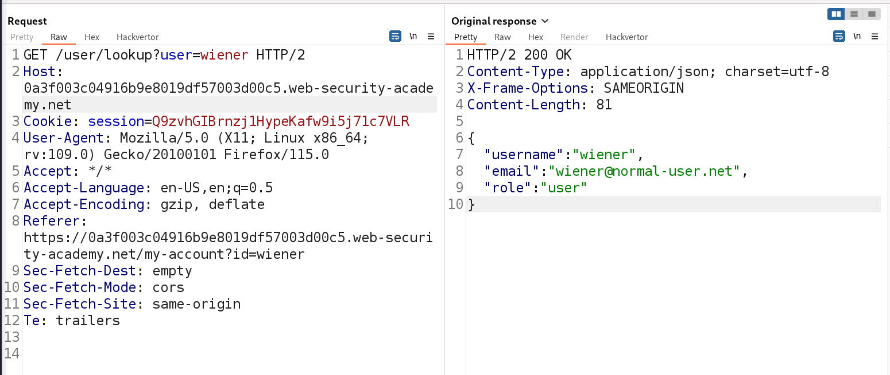
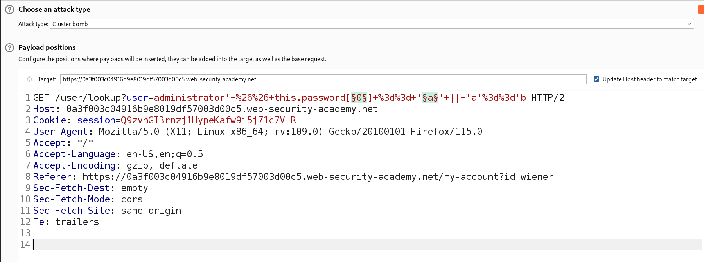

### Exploiting NoSQL injection to extract data : PRACTITIONER

---

The application is vulnerable to NoSQL injection, and the injection point is the user lookup functionality.
- Given credentials are `wiener:peter`.
- Need to obtain the password for the `administrator` user.

After logging in to the application with `wiener:peter`, using Burp Suite HTTP History tab, observe there is a request to `/user/lookup?user=wiener`.



To attack this point, we can inject a conditional payload.
- Sending it to REPEATER.
- We need to notice the difference in the response when submitting a TRUE payload and a FALSE payload to be able to enumerate information.

First, we identify that the `'` quote is enough to inject a payload, as it causes an error.


Now, we need to enter an always true condition, and see how it reacts.
```
wiener' && 'a'=='a
```

Before sending it, we need to first URL-encode it.
```
wiener'+%26%26+'a'%3d%3d'a
```

Sending this as a payload, we see that it returns the user information normally.


Now, we need a false condition to see if it behaves differently.
- Modifying the above payload such that it is false.
```
wiener'+%26%26+'a'%3d%3d'b
```


We see that it returns the text `Could not find user`, and it does not cause an error.

> Now, we need to try and enumerate the password by using a payload that also uses conditional logic.

This payload will evaluate to false only if the first character of the password is not `p`, or the username is not `wiener`.
```
wiener' && this.password[0] == 'p' || 'a'=='b
```
- We know that the username `wiener` exists, and the first letter of the password is `p`. 
- Submitting this payload, but URL encoding it first, we should see the response of the true condition.


We see that it works, and we get the user information as expected.
- Now, we need to create the exact same payload, but for the `administrator` user.

```
administrator' && this.password[0] == 'a' || 'a'=='b
```
- We need to send this to INTRUDER, and have payloads at the index and a payload at the character of the password.

We choose a Cluster bomb attack, and set the payloads as described.



- For the first payload, we set a large number like 15. We can choose the numbers list.
- For the second payload, we use all alphanumeric characters. We can choose the brute forcer list.

Starting the attack, we see that there are 2 response size.
- One for the true condition, and another for the false condition.


The 209 size is the size of the true response.
- We see there are only 8 characters in the password.

The password is : `lnybmrmn`

Logging in with the admin credentials to complete the lab:


---
