### Exploiting NoSQL operator injection to extract unknown fields : PRACTITIONER

---

The user lookup functionality is vulnerable to NoSQL injection.
- We need to login as the user `carlos`, and we need to find the reset token for the user `carlos`.

With Burp Suite HTTP History tab open, try logging in as the user `carlos` with any password, and observe the request.

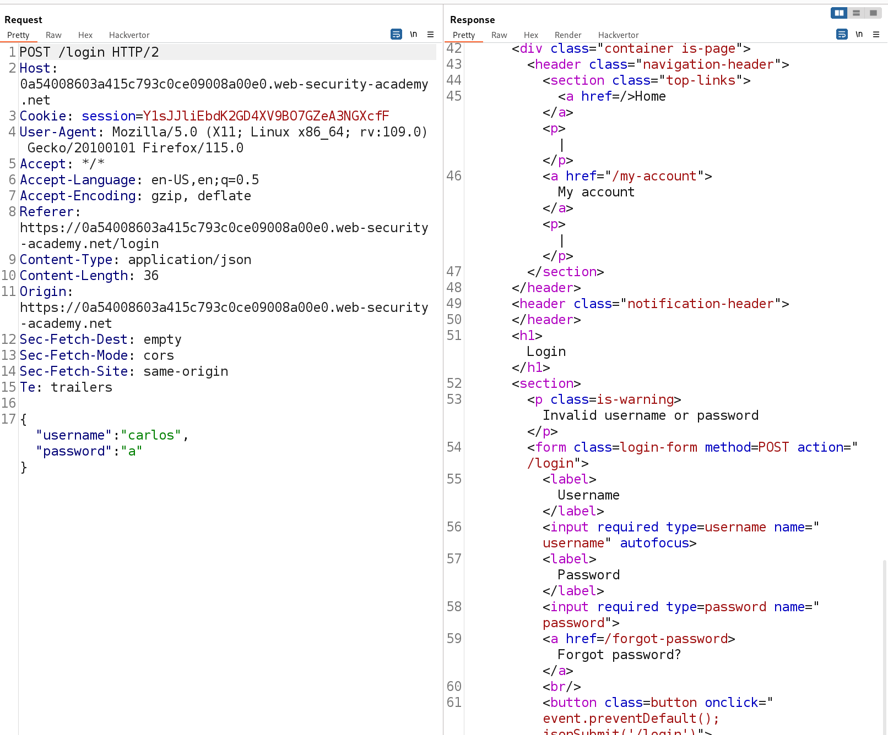

We see there is a `POST` request sent with a `JSON` body that has the username and password, and the response says `Invalid username or password`.
- We can try to inject an operator here to exfiltrate data.

Trying the `$ne` operator to try and login as `carlos`.
```
{
	"username":"carlos",
	"password":{
		"$ne":""
	}
}
```

We get the following response: `Accpunt Locked: please reset your password`.

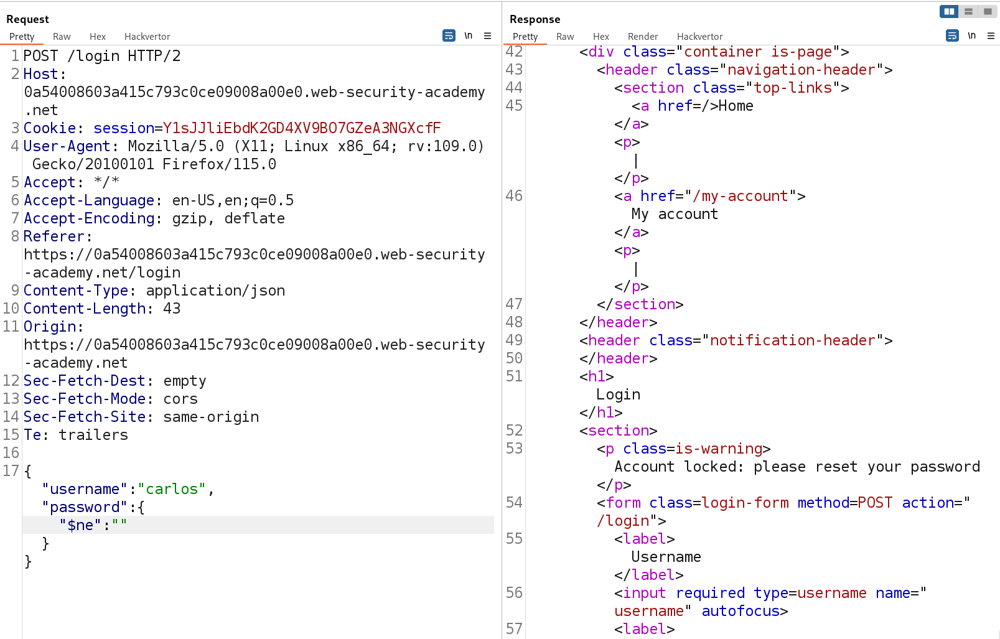

This implies that the injection worked.
- Trying to forget password for the user sends an email that we do not have access to.
- We can try to inject another payload in the `JSON` as an extra parameter, and see if we can work from there.

To add another payload, we need to utilize conditional responses.
- Therefore, we need a true condition and a false condition, and see how the website responds.

The true condition:
```
{"username":"carlos","password":{"$ne":""}, "$where":"1"}
```

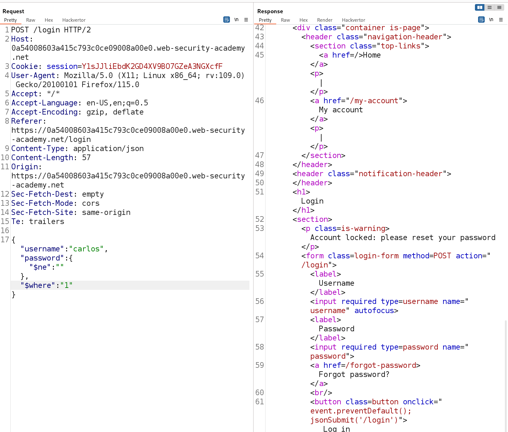

This returns the text `account locked`.

The false condition:
```
{"username":"carlos","password":{"$ne":""}, "$where":"0"}
```

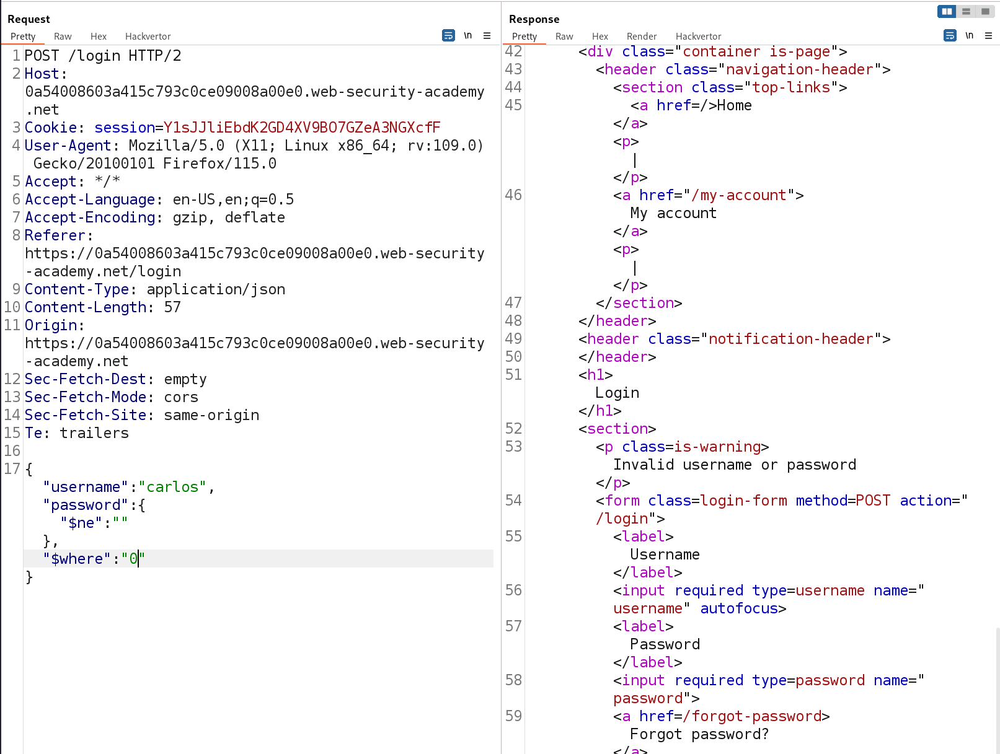

This returns the text `invalid username or password`.

Since we have 2 different types of responses, we can try to enumerate data fields.
- If the enumeration returns the `account locked message`, then the condition we entered evaluated to true.

To obtain the names of the fields, we can use the following payload:
```
"$where":"Object.keys(this)[0].match('^.{0}a.*')"
```
- The first `0` is the number of the field. We change this to get different fields.
- The second `0` is the index of the character we are testing.
- The letter `a` in the `match` function is the character we are matching against.

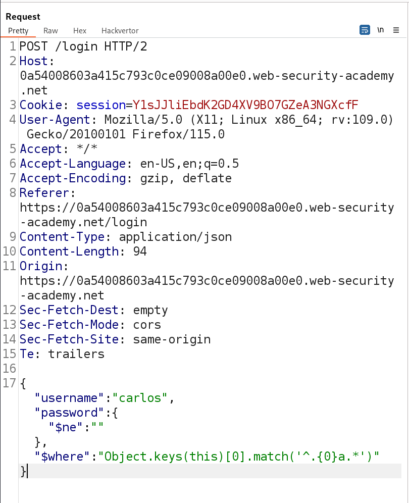

This is how the request looks like. Sending this to Intruder and choosing a Cluster Bomb attack for each field.
- We can try this for many fields until we obtain any new fields.
- The parameters we will add placeholders for in Intruder will be the second 0 and the letter.

For field number 0:

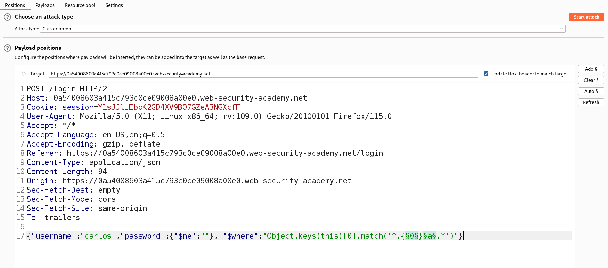

- Set the first payload to a list of numbers, from 0-20.
- Set the second payload to simple list and choose from `add from list` option all alphanumeric: small, capital, and the numbers.

Starting the attack:

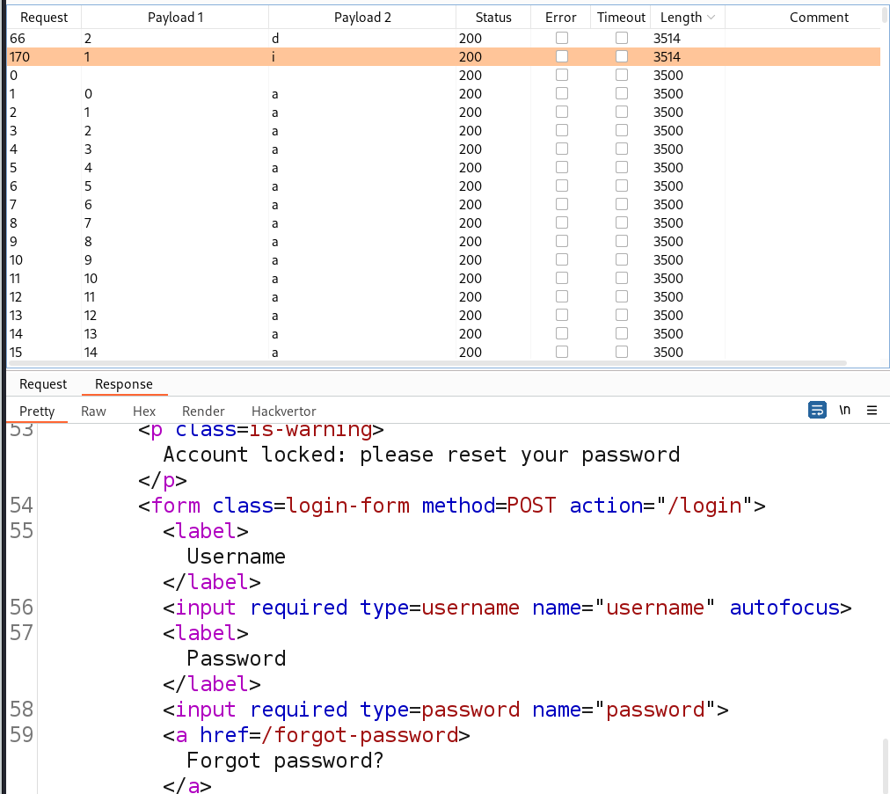

Notice that the response with the `account locked` has a different size, which we will use to sort out the relevant rows.
- We see that we have the column `id`.

For field number 1 we do the same exact thing, and we expect to see the username field as output.
- Simply change the number in the square brackets before the `match` function.

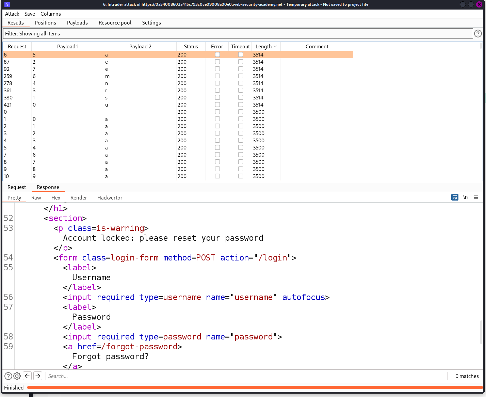

We see that we get the `username` field.

Trying with field number 2, we expect to see `password`.

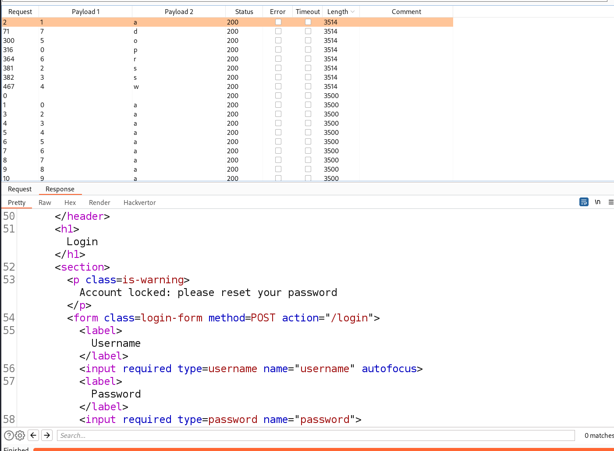

Trying to get a new field now, we try number 3.

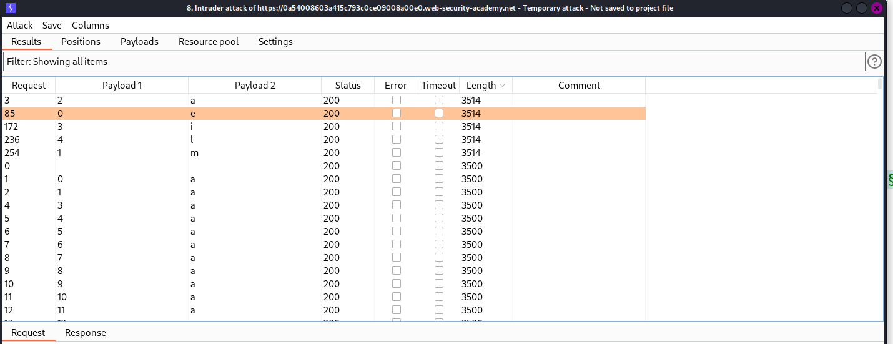

We get a field called `email`.

Trying again, we try number 4.

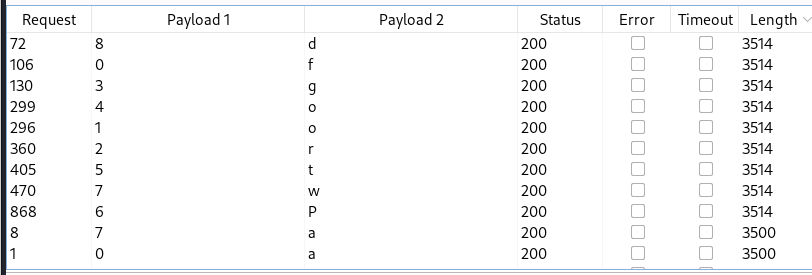

We get the field called `forgotPwd`

> We can use this field, and try to exfiltrate data from it by accessing it and then using the `match` function.

By using the same `$where` parameter, we add a payload that accesses this column for the forget password token, and tries to match it.
- We know that if returns a true match, then the website will display `account locked`, and if it is not true, then it will display `invalid account`.
```
{
	"username":"carlos",
	"password":{"$ne":""},
	"$where":"this.forgotPwd.match('^.{0}a.*')"
}
```
- This checks if the first character is `a`.
- We can use a Cluster Bomb attack to exfiltrate the data in that field by trying several indices and all alphanumeric characters.
- use the same Cluster Bomb attack as above but change the `$where` parameter.

Running the attack, we see this value: `90d3bd98cadd8d60`

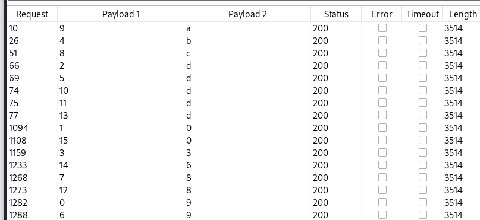

Now that we know the reset token value for the user `carlos`, we need to find a way to submit this value.
- Surfing through the forget password flow, we see there is a request `GET /forgot-password`.

Trying to add the column `forgotPwd` as a query parameter and give the value of the token as a value works, and we see in the response that we can change the password of that user.

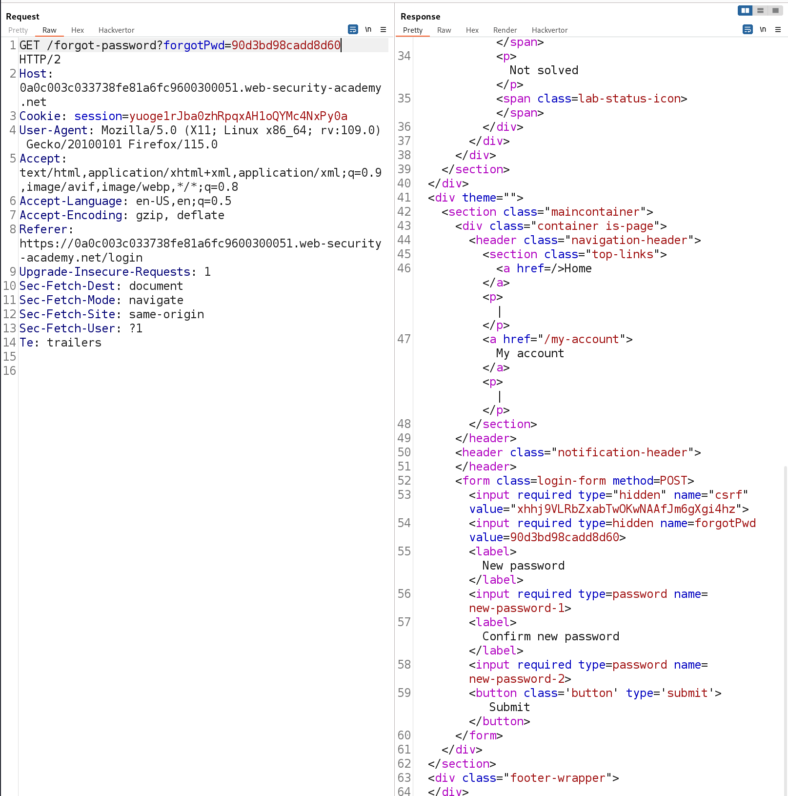

Viewing this response in browser, we can enter a new password.
- logging in as the user `carlos` with the new password completes the lab.

---
