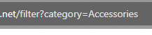
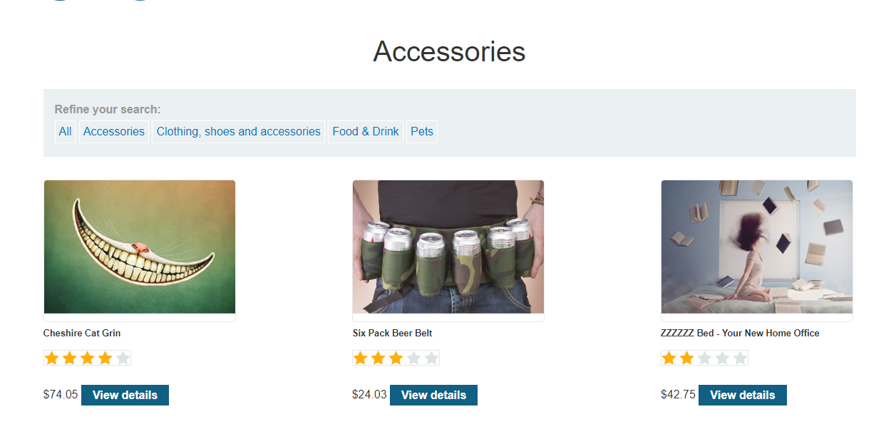
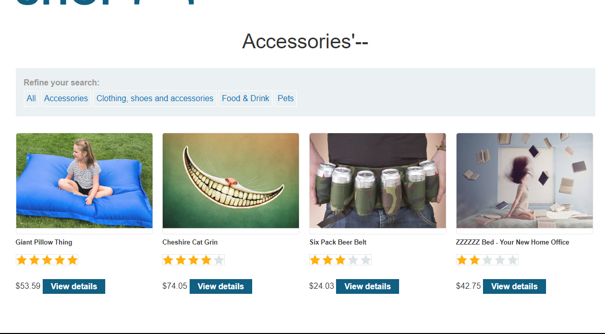

### SQL injection vulnerability in WHERE clause allowing retrieval of hidden data : EASY

---


> Check the different categories and realize that there is a new `category` parameter in the URL.





> If we add the `'--` payload after the `category=accessories` query parameter, we see more items.



> Therefore, it is vulnerable to SQL injection.
> Now, we can try using a more complicated attack to list all items.
> Try using OR Boolean attack
```
' OR 1=1-- 
```
> Displays all items of all categories whether released or not.

---
