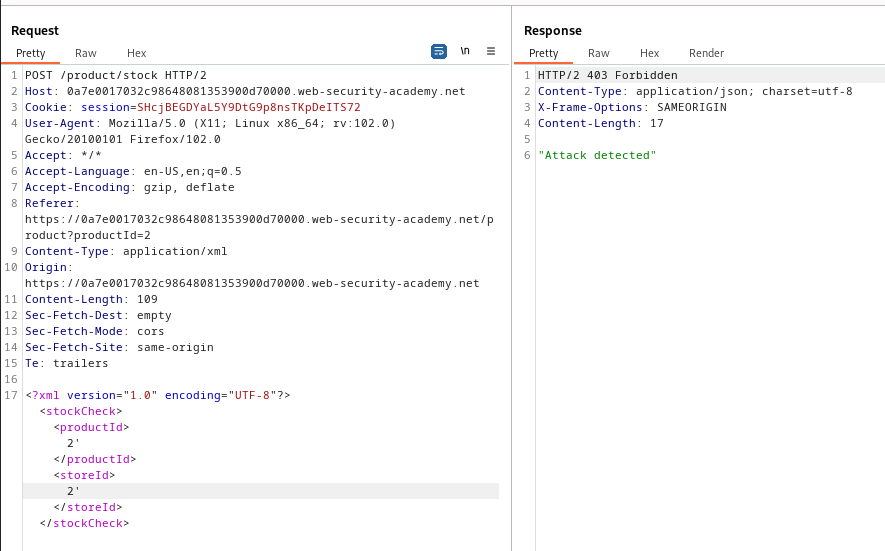

### SQL injection with filter bypass via XML encoding : PRACTITIONER

---

Open an item with Burp Suite HTTP History tab open, and press on the check stock button.


Adding a `'` in both `productId` and `storeId` does nothing and the Burp Suite Repeater indicates that an attack was detected. 
- We care for the `stockId` parameter as indicated by the lab.



We want to read data from the `users` table, so we craft a simple exploit to check for its existence:
- We place this in the `StoreId` entity.
```SQL
2 UNION SELECT NULL FROM users
```

> Use the `hackvertor` extension to encode the sql injection to not be detected by the web application firewall. This is done by selecting the payload, and choosing extensions, hackvertor, encode, hex_entities.


We see that it passes, and that the payload has the correct number of columns as the website functions normally.

> We can use concatenation to combine the usernames and passwords from the `users` table in 1 column.

```SQL
2 UNION SELECT username || ':' || password FROM users
```


We see the username and password for the admin user.

---
