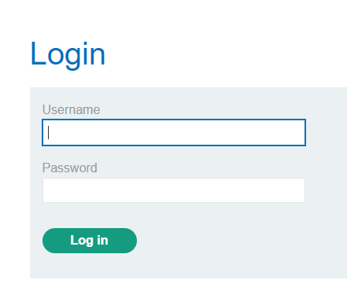

### SQL injection vulnerability allowing login bypass : APPRENTICE

---

Head to the login page.



To check if these inputs are vulnerable, we try injecting a `'` single quote character.
- The username appears to be vulnerable, as it returns a server error.

> Now, we can try bypassing this login page by choosing the `administrator` user, and using SQL syntax to ignore the password column in the query.

This can be done by changing the username to
```
administrator'--
```

Transforming this query:
```SQL
SELECT * FROM users WHERE username = '' AND password = ''
```

To this: 
```SQL
SELECT * FROM users WHERE username = 'administrator'-- ' AND password = ''
```
- Completely ignoring everything after the `--` comments.

> After submitting the new username `administrator'--`, and adding any random password, we see that we are now logged in as administrator.

---
