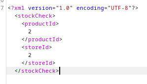
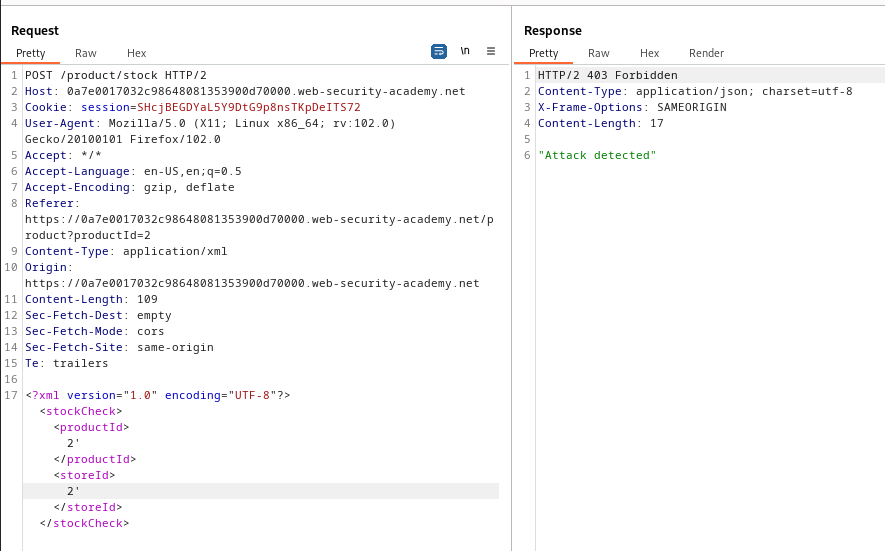
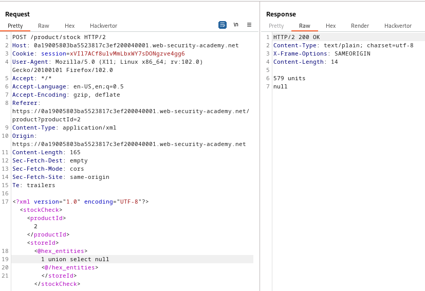
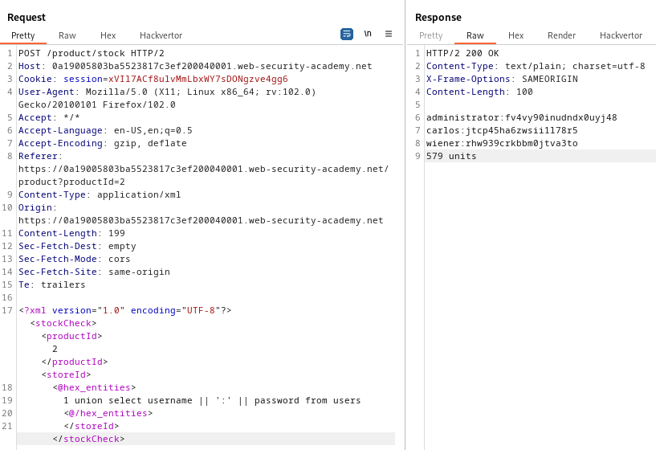

### SQL injection with filter bypass via XML encoding : PRACTITIONER

---

> Use burpsuite to intercept request for the second item, there is a `productId` parameter. 
> There is also a parameter for `storeId` after pressing on check stock button.
> The request is in XML and has UTF-8 encoding.




> Adding a `'` after the 2 in both productId and storeId does nothing and the burpsuite repeater indicates that an attack was detected. We care for the stockId.




> Use the hackvertor extension to encode the sql injection to not be detected by the web application firewall.

> Try normal payloads and see that the "attack detected" message is no longer there.

> Try the payload in the storeId parameter to get usernames and passwords.
```
<@hex_entities>4 union select username, password from users<@/hex_entities>
```
> Doesn't work, maybe number of fields isnt matching.

> Need to figure out the number of output columns. If an NULL or empty string is output after a value, then the number of columns matches. Otherwise, keep adding ,NULL until it works.
```
<@hex_entities>1 union select null <@/hex_entities>
```

> The output field has 1 column only as the output is as stated.



> So we have to change the query such that it fits the output data in 1 column using the concatenation `||` tool.
```
<@hex_entities>

 1 union select username || ':' || password from users

<@/hex_entities>
```




> Now we can login as admin and the lab is complete.

---
