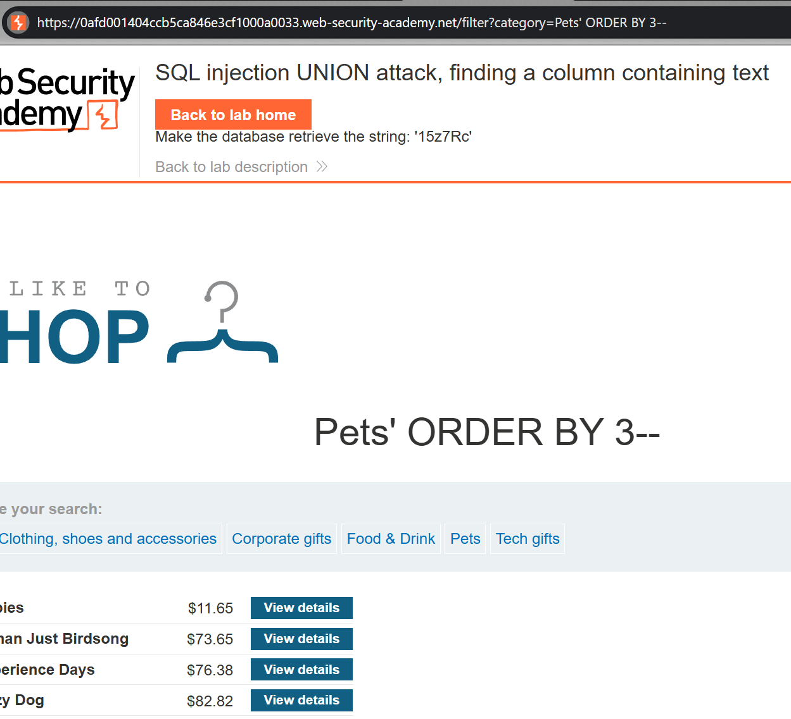

### SQL injection UNION attack, finding a column containing text : PRACTITIONER

---

Since the `category` query parameter is vulnerable to SQLi, we inject all our payloads there.



Get the number of columns using the `order by` technique. Keep increasing order by index until an error is produced.
```
Accessories' ORDER BY 4--
```
- Number of columns is 3 since we got the error at 4.

Since we want to make the database retrieve a string, we need to find the column that returns a string.
- We can do that by using the following query, and trying to place a string instead of each `NULL`.

```
' UNION SELECT NULL, NULL, NULL--
' UNION SELECT 'a', NULL, NULL --
' UNION SELECT NULL, 'a', NULL --
' UNION SELECT NULL, NULL, 'a' --
```

The second column is of type string as the website returns a response that isn't an error. The payload used:
```
' UNION SELECT NULL, 'a', NULL --
```

> Now we know which column is text. We need to retrieve the value `15z7Rc` from the database.

So we modify the above query to be:
```
' UNION SELECT NULL, '15z7Rc', NULL --
```

An extra row is output with the wanted data.

---
