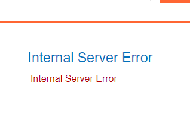
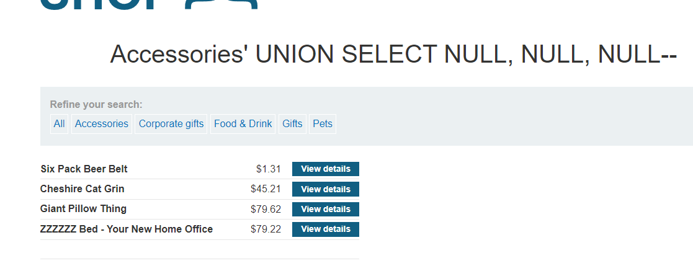

### SQL injection UNION attack, determining the number of columns returned by the query : PRACTITIONER

---

> Open different categories and see that there is a category parameter.


> We know that it is vulnerable to UNION based injection, but we need to figure out the number of columns that are in the original query, to do that, we use the adding `NULL` technique.

> Try the exploit by adding it to the query parameter `category` that is vulnerable to SQLi.
```
Accessories' UNION SELECT NULL --
```



> Doenst work, so keep adding `NULL,` until it clicks.
> Works at 3 `NULL` added, so there are 3 columns in the query.

```
Accessories' UNION SELECT NULL, NULL, NULL--
```



> We see an extra row of null values, meaning that our UNION attack works, as the other query we appended to the original one returns NULL data.

---
